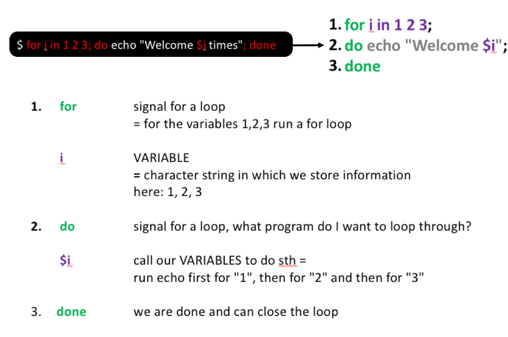

<div style="text-align: justify">

# Introduction to Bash

## `pwd`: Find out where we are

To get started, open your terminal and get yourself oriented by typing your first command, `pwd`, and then pressing enter:

```{bash}
pwd
```

The command `pwd` stands for *print working directory*. The **working directory** is the folder your shell is operating on right now, so `pwd` tells you where you currently are in the file system. You should see something like this:

```
/Users/YourUserName
```

When you open a new terminal, you start in what is called your **home directory**. This is your personal folder on the computer.

What the path to your home directory looks like depends on your system:

-   **Mac:** `/Users/YourUserName`
-   **MobaXterm (Windows):** `/home/mobaxterm`
-   **WSL2 (Windows) and Linux:** `/home/YourUserName`

In this tutorial, we work inside the home directory. That way, the commands are the same for everybody.

## `ls`: List the contents of a directory

Now that you know where you are, let's find out what is inside that location, i.e. what files and folders can be found there. The command `ls` (short for *list*) shows the files and folders in your current directory. Type the following and press enter:

```{bash}
ls
```

In my case this returns something like this (and this will look different for your current directory):

<p align="left">


</p>

The colors and formatting depend on your terminal settings, but typically:

-   Folders (directories) appear in one color (in my example above: green)
-   Files appear in another (in my example above: bold white)

If your directory contains many items, the output can quickly become overwhelming. To make sense of it, we can use options and arguments to control how commands behave.

## The structure of a command

A command generally has three parts:

-   A **command name**: the program you want to run, e.g. `ls`
-   An **option** (or **flag**): a way to change how the command behaves, e.g. `-l` (long format). Options usually start with a `-`
-   An **argument**: the input the command works on, e.g. a file or folder. Some commands work without an argument

<p align="left">


</p>

Try the following command in your current directory to list (`ls`) the contents of the current folder and show details in long format (`-l`)":

```{bash}
ls -l
```

After running this, we see our files and folders again but as a more detailed list. In the example below you can now see additional information about who is allowed to read and change the files (the access modes), who owns them, how large the files are, when they were last modified and of course their name:

<p align="center">


</p>

::: {.callout-tip title="Tip: Using ls in practice" collapse="false"}
Throughout this tutorial, you'll notice that we use `ls` a lot. There is a reason for that.

When working with data, sanity checks are essential, because it is easy to make mistakes, overwrite files, or lose track of where things are. Simple commands like `ls`, `pwd`, `wc` or `grep` help you check what is happening to your files at every step of an analysis.

These habits are not just for beginners, bioinformaticians rely on them constantly.
:::

## Getting help

At some point, you'll want to know what options a command has or how it works. In this case, first check if a **manual page** (or *man page*) is available for the command by typing `man` followed by the command name:

```{bash}
man ls
```

This opens the manual entry for the command `ls`. You can move through it using:

-   the ↑ / ↓ arrow keys, or the space bar to move down one page
-   `b` to move back up one page
-   `q` to quit the manual

Not all programs come with such a manual. Depending on the program, there are a few common ways to get help that you can try:

-   `man ls`
-   `ls --help`
-   `ls -h`

## `mkdir`: Make new folders

Before we start moving around, let's first learn how to create new folders (also called directories). This is something we will do often, for example to keep raw data, results and scripts organized in separate places. The command we use for that is `mkdir`, which stands for *make directory*.

We use `mkdir` to create a project folder called `data_analysis` for this tutorial. Don't worry about the `cd ~` in the first line yet, we cover moving around in the next section. For now, it is enough to know that it takes you to your home directory.

```{bash}
# Move into the home directory
cd ~

# Create a new folder called data_analysis
mkdir data_analysis

# Check that the folder was created
ls
```

You should see a new folder called `data_analysis` in the list. We will use this folder as our project folder for all exercises in this tutorial.

You can also look at the same folder in the file browser you know from Windows or Mac. The command below opens the folder you are in right now. The dot (`.`) is short for "the current folder":

```{bash}
# Windows (MobaXterm or WSL2): open the current folder in File Explorer
explorer.exe .

# Mac: open the current folder in Finder
open .
```

Use the command for your own system. You should see a window with your home directory and the new `data_analysis` folder in it. This is useful later, for example to open a report that you made with the command line. (Linux users: try `xdg-open .`)

::: {.callout-important title="MobaXterm users: did you choose a permanent folder?" collapse="false"}
If `explorer.exe .` opens a folder in a temporary location, MobaXterm deletes your work when you close it. You can see this in the address bar of File Explorer: it shows `Temp`, for example `Local > Temp > Mxt265 > mx86_64b > tmp > home_YourUserName`. Before you continue, follow the steps in [MobaXterm: choose a permanent folder](installation.qmd#mobaxterm-choose-a-permanent-folder) on the "Before you start" page. Then make the `data_analysis` folder again.
:::

Next, let's make a `data` folder inside the new `data_analysis` folder:

```{bash}
# Make a data folder inside the data_analysis folder
# The -p option also makes the parent folder (here: data_analysis) if it does not exist yet
mkdir -p data_analysis/data

# Check that the folder was created
# Notice how we use ls with an option (-l) and an argument (data_analysis)?
ls -l data_analysis
```

::: {.callout-tip title="Tip: Commenting your code" collapse="false"}
Notice how I added a `#` and some notes above each command?

Anything written after a `#` in bash is a **comment**. A comment is not executed, but it helps you (and others) understand what the code does.

In your own work, add short, meaningful comments above key steps. Avoid restating the obvious. Instead, explain *why* you do something or what it achieves. A good rule: add a comment wherever you think that future you might get confused a month later.

[Here](https://best-practice-and-impact.github.io/qa-of-code-guidance/code_documentation.html) you find some examples for Python and R, but the same logic applies to bash. Some bash examples can be found [here](https://linuxize.com/post/bash-comments/).
:::

## `cd`: Move around folders

Now that we have our own project folder, let's learn how to move around the file system with `cd` (short for *change directory*).

The file system is structured like a tree that starts from a single **root** directory, written as a forward slash (`/`). All other folders branch out from this root directory. For example, we can go from the root directory to the users folder, and from there into the john folder: `/users/john`.

<p align="center">


</p>

The location of a file or folder is written as a **path**: the folder names along the way, separated by `/`. There are two ways to write a path, for example to the portfolio folder:

-   An **absolute path** starts from the root, e.g. `cd /users/john/portfolio`
-   A **relative path** starts from your current location, e.g. `cd portfolio` if you are already in `/users/john`

It is generally recommended to use relative paths from inside your project folder. That makes your code more portable: it still works if you move the project folder or run it on another computer.

Let's practice moving between folders. At each step, use `pwd` if you feel that you get lost:

```{bash}
# Move into the data_analysis folder
cd data_analysis

# Check where you are
pwd
```

You now should see something like `/Users/YourUserName/data_analysis`. You can use `cd` in multiple ways to move around:

```{bash}
# Move into the data folder
cd data

# Move one level up (..), i.e. go back to the data_analysis folder
cd ..

# Quickly go back home (you now should be in the home directory)
cd ~

# Move multiple levels down at once
cd data_analysis/data

# Move two levels up, i.e. back into the home directory
cd ../..

# And go back to the data_analysis folder
cd data_analysis
```

In the code above, the tilde symbol (`~`) is a shortcut for your home directory. It is the same as typing the full absolute path to your home (e.g. `cd /Users/YourUserName`), but much faster to type. Two dots (`..`) always mean "the folder one level up".

::: {.callout-tip title="Tip: Command-line completion" collapse="false"}
Here are some tips for faster navigation (and fewer typos):

-   Use the Tab key for autocompletion: type the first few letters of a folder or file name and press Tab. For example, go to your home directory, type `cd data_` and press Tab. The shell fills in `data_analysis` for you.
-   If there is more than one match, the shell can not decide which one you mean. Press Tab twice to see all options.
-   Use the ↑ / ↓ arrow keys to scroll through commands you ran before. This is useful to rerun a command or to change a small part of it.

From now on, try to use the Tab key often, so that you do not have to type everything yourself.
:::

::: {.callout-question .callout-warning collapse="false" title="Exercise"}
Get familiar with these first commands:

1.  Create a new folder called `results` inside your `data_analysis` folder. We will use it later to store the output of our analyses
2.  Move into the `results` folder and confirm your location with `pwd`
3.  Move back into the `data_analysis` folder
4.  Use `ls` to confirm that both `results` and `data` are there

::: {.callout-answer .callout-warning collapse="true" title="Click me to see an answer"}
```{bash}
# Starting from inside data_analysis
mkdir results
cd results
pwd
cd ..
ls
```
:::
:::

::: {.callout-tip title="Tip: Finding your Desktop and OneDrive folders (optional)" collapse="true"}
In this tutorial we stay inside the home directory. If you want to work with files that are somewhere else on your computer, for example on your Desktop, these paths help you find them:

**Mac**

-   Your Desktop is at `/Users/YourUserName/Desktop`, or with the `~` shortcut: `~/Desktop`

**MobaXterm and WSL2 (Windows)**

The terminal reaches your Windows files via the C drive, which is found at `/mnt/c`:

-   Your Desktop is usually at `/mnt/c/Users/YourUserName/Desktop`
-   Or at `/mnt/c/Users/YourUserName/OneDrive/Desktop` (when using OneDrive)

**Accessing the UvA OneDrive folder**

If your OneDrive folder name includes spaces (like `OneDrive - UvA`), put quotes around the path. Otherwise bash does not know what to do with the spaces:

```{bash}
cd "/mnt/c/Users/YourUserName/OneDrive - UvA"
```

This is also a good example of why you normally do NOT want spaces in your file and folder names.

Be careful with large sequence files in OneDrive folders: OneDrive tries to upload every file you make there.
:::

## `wget`: Download data

Next, let's download our sequencing data, a file called `seq_project.tar.gz`, with `wget`. Make sure that you are inside your `data_analysis` folder (check with `pwd`), because `wget` saves the file in the folder you are currently in:

```{bash}
# Download data using link provided by the sequencing center on 23.01.2023
wget https://raw.githubusercontent.com/ndombrowski/cli_workshop/main/data/seq_project.tar.gz
```

In this example, you can also see how I documented my code: I added where the link came from and when I got it. This helps future me in case I, for example, need to look for some e-mails about the data later on.

::: {.callout-important title="Wget for Mac users" collapse="false"}
For Mac users `wget` is not installed by default. If you do not want to install it, you can use the `curl` command instead:

```{bash}
# -L: if the server says that the file is somewhere else, follow it until you reach the actual file
# -O: save the file under its original name
curl -LO https://raw.githubusercontent.com/ndombrowski/cli_workshop/main/data/seq_project.tar.gz
```
:::

After you download any kind of data, it is always a good idea to do a sanity check: is the file there, and how large is it? A file size of 0 means that something went wrong during the download.

::: {.callout-question .callout-warning collapse="false" title="Exercise"}
1.  Check with `ls` if the file was downloaded correctly
2.  Check the manual if there are extra options that we can use for `ls` to see the file size in an easy-to-read unit, such as K (kilobytes) or M (megabytes) (advanced)

::: {.callout-answer .callout-warning collapse="true" title="Click me to see an answer"}
```{bash}
# Question 1:
ls -l

# Question 2:
# -h prints the size in a human-readable format
# Options can be combined: -l and -h become -lh
ls -lh
```
:::
:::

## `cp`: Copying data

`cp` (short for *copy*) duplicates files or folders. When working with many files, a good folder structure is essential to keep track of them (useful folders are, for example, `data`, `scripts` and `results`). To keep our project folder organized, let's copy the `seq_project.tar.gz` file we just downloaded into the `data` folder we made earlier:

```{bash}
# Copy the tar.gz file into the data folder
cp seq_project.tar.gz data/

# Check what happened
ls -l
ls -l data
```

When running the two `ls` commands, we see that we now have two copies of `seq_project.tar.gz`: one file is in our working directory and the other one is in our data folder. Copying large amounts of data is not ideal, since it uses unnecessary space. However, we can use another command to move the file into our data folder instead.

## `mv`: Moving (and renaming) data

`mv` (short for *move*) moves files or folders to a new location without creating a second copy:

```{bash}
# Move the tar.gz file into the data folder
mv seq_project.tar.gz data/

# Check what happened
ls -l
ls -l data
```

Notice that `mv` moved the file and, **without asking**, overwrote the copy that we had put into the data folder with `cp`. So whenever you use `mv`, make sure that you do not overwrite files by mistake.

`mv` is also the command to rename a file: you "move" it to a new name, e.g. `mv old_name.txt new_name.txt`.

::: {.callout-tip title="Tip: Downloading directly into a folder" collapse="true"}
Instead of downloading a file and moving it afterwards, you can tell `wget` directly where to save the file with the `-P` option:

```{bash}
wget -P data https://raw.githubusercontent.com/ndombrowski/cli_workshop/main/data/seq_project.tar.gz
```

**MobaXterm users:** MobaXterm comes with a simpler version of `wget` that does not know the `-P` option. You see the error `wget: Unknown option P`. In that case, download the file first and then move it with `mv`, as we did above.

**Mac users:** if you use `curl` instead of `wget`, you can save the file into a specific folder with `--output-dir`:

```{bash}
curl --output-dir data -LO https://raw.githubusercontent.com/ndombrowski/cli_workshop/main/data/seq_project.tar.gz
```
:::

## `tar`: Work with tar files

The data we downloaded is provided as a tar file:

-   tar is short for Tape Archive, and sometimes referred to as tarball
-   The TAR file format is commonly used when storing data
-   TAR files are often compressed after being created and then become TGZ files, using the tgz, tar.gz, or gz extension.

We can decompress the data into our data folder as follows:

```{bash}
tar -xvf data/seq_project.tar.gz -C data
```

The options we use with the `tar` command are:

-   `x` tells tar to extract files from the archive
-   `v` (verbose) prints the name of each file while it is being extracted, so you can see what happens
-   `f` specifies the file name
-   `C` tells tar to change directory (so the package content will be unpacked there)

::: {.callout-tip title="Tip: how to generate a tarball" collapse="true"}
If you ever want to generate a tarball you can do the following:

```{bash}
tar -cvzf my_tarball.tar.gz folder_to_tar
```

The options we use are:

-   `c` create an archive by bundling files and directories together
-   `z` use gzip compression when generating the tar file
:::

::: {.callout-question .callout-warning collapse="false" title="Exercise"}
1.  After extracting the tarball, use `ls` to explore the content of the folder we just extracted. Make sure that you also explore the content of the folders inside it.
2.  Find the path for at least one sequence file that ends with `fastq.gz`. Hint: use the Tab key (see the tip on command-line completion above), so that you don't have to type every single word.

::: {.callout-answer .callout-warning collapse="true" title="Click me to see an answer"}
```{bash}
# Question 1:
ls -l data/seq_project

# Question 2:
ls -l data/seq_project/barcode001_User1_ITS_1_L001/
```
:::
:::

## `rm`: Remove files and folders

To remove files and folders, we use the `rm` command (short for *remove*). We want to remove the `seq_project.tar.gz` file, since we do not need it anymore once we have extracted the data:

```{bash}
# Remove the tar.gz file from the data folder
rm data/seq_project.tar.gz

# Check if that worked
ls -l data
```

If we want to remove a folder, we need to tell `rm` with an option. For this, we use `-r` (short for *recursive*), which removes a folder together with everything inside it.

::: callout-important
**Unix does not have an undelete command.**

This means that if you delete something with `rm`, it's gone. There is no recycle bin. Therefore, use `rm` with care and check what you wrote twice before pressing enter!

Also, NEVER run `rm -r` or `rm -rf` on the root folder `/` or any other important path, such as your home directory. Always double check the path or file name before you press enter when using `rm`.
:::

## Wildcards

After we have explored the folder with our sequencing data with `ls`, we have seen that `data/seq_project` contains 4 folders, 2 folders for two different users who each generated two samples.

You also might have noticed that it gets tedious to figure out how many files are in each folder, because we would need to run `ls` on each single folder and view its contents one by one. Typing every file name by hand also gets tedious, and you risk typos.

Luckily, the shell provides special characters to work with groups of files using pattern matching. These characters are called **wildcards**. The most useful wildcard is `*`, which stands for "any characters, any number of times (also zero times)". For example, `*.txt` matches all files that end with `.txt`.

We can use `*` to list all files in the `seq_project` folder as follows:

```{bash}
ls data/seq_project/*
```

{width="242"}

You should have seen before that the sequencing files all end with `.fastq.gz`. With this, we can make the command a bit more specific and at the same time make the output more readable. `*/*.gz` means "inside any folder, any file that ends with `.gz`":

```{bash}
ls data/seq_project/*/*.gz
```

{width="558"}

If we wanted to print the absolute and not the relative path, we could do the following (beware that the absolute path will be slightly different depending on your system, check yours with `pwd`):

```{bash}
ls /home/YourUserName/data_analysis/data/seq_project/*/*.gz
```

Now we can easily see for each folder how many files we have.

::: {.callout-question .callout-warning collapse="false" title="Exercise"}
1.  Use a wildcard to list files for barcode001 only
2.  Use a wildcard to only list R1 (i.e. forward) files
3.  Use a wildcard to copy all R1 files into a new folder, call this new folder `R1_files`. Use `ls` to confirm if you copied the right files
4.  To avoid duplicates, remove the R1_files folder from question 3 after you have ensured the command you used worked

::: {.callout-answer .callout-warning collapse="true" title="Click me to see an answer"}
```{bash}
# Question 1:
ls data/seq_project/barcode001*/*gz

# Question 2:
ls data/seq_project/*/*R1*

# Question 3:
mkdir R1_files
cp data/seq_project/*/*R1* R1_files
ls data/seq_project/*/*.gz
ls -l R1_files

# Question 4:
rm -r R1_files
```

After solving question 2 you should see:

{width="489"}

After solving question 3, we should see that all files still exist in their original location but are now also inside the `R1_files` folder. Notice how we can use wildcards together with other commands to easily reorganize our data?
:::
:::

::: {.callout-tip title="Tip: More wildcards" collapse="true"}
`*` is not the only wildcard we can use and a full list can be found [here](https://tldp.org/LDP/GNU-Linux-Tools-Summary/html/x11655.htm).

Different wildcards can be useful in different contexts, not only only when listing files but also finding patterns in files. To make such searches as specific as possible there are different wildcards available. A few examples are:

The \[0-9\] wildcard = matches any number exactly once and allows us to extract a range of files.

```{bash}
ls data/seq_project/barcode00[0-9]*/*.gz
```

The \[012\] wildcard = matches 1 or 2 exactly once and allows us to extract a range of files.

```{bash}
ls data/seq_project/barcode00[12]*/*.gz
```

\[A-Z\] matches any letter in capitals occurring once

\[a-z\]\* matches any letter in non-capital letters occurring many times

```{bash}
ls data/seq_project/barcode001_User1_ITS_1_[A-Z]001/*.gz
```
:::

## I/O redirection to new files

What a command prints is called its **standard output**. We have seen that by default, commands print their standard output directly to the terminal. For example, when we use `ls`, the list of files and folders is printed to your terminal. However, we can also **redirect** the standard output into a file by using the `>` character.

For example, we might want to generate a list with all fastq files and can do this as follows:

```{bash}
# Write the list of fastq files into a new file instead of to the screen
ls data/seq_project/*/* > fastq_paths.txt

# Check that the new file exists
ls -l fastq_paths.txt
```

Here:

-   `ls data/seq_project/*/*` lists all files in the folders inside `seq_project`
-   `>` tells the shell to write this list into a new file called `fastq_paths.txt`, instead of printing it to the screen

::: {.callout-important title="Important: Be careful with >" collapse="false"}
The `>` operator overwrites files **without asking**. If a file with the same name already exists, its content is replaced.

If you want to add (append) to the end of an existing file instead of replacing it, use `>>`.
:::

## Exploring the content of text files

Next, let's view the content of the list we just generated. Viewing the actual files we work with is often important to ensure the integrity of our data.

### `head`: View the first rows of a file

`head` can be used to check the first 10 rows of our files:

```{bash}
head fastq_paths.txt
```

### `tail`: View the last rows of a file

If you want to check the last 10 rows use `tail`:

```{bash}
# Show the last 10 lines
tail fastq_paths.txt

# Show the last 3 lines
# The option -n controls how many lines get printed (this also works for head)
tail -n 3 fastq_paths.txt
```

### `less`: View the full file

`less` is a program that lets you view a file's contents one screen at a time. This is useful when dealing with a large text file (such as a sequence data file), because it doesn't load the entire file but accesses it page by page, resulting in fast loading speeds.

```{bash}
less -S fastq_paths.txt
```

-   You can use the ↑ / ↓ arrow keys and the Page Up / Page Down keys to move through the text file
-   To exit less, type `q`

::: {.callout-tip title="Tip: Editing text files" collapse="true"}
You can also edit the content of a text file and there are different programs available to do this on the command line, the most commonly used tool is `nano`. It comes with WSL2, Mac and most Linux systems. You can open any file as follows:

```{bash}
nano fastq_paths.txt
```

Once the document is open you can edit it however you want and then

-   Close the document with `control + X`
-   Type `y` to save changes and press enter

**MobaXterm users:** `nano` is not installed in MobaXterm by default, and you see `nano: command not found`. You can install it with `apt install nano`. Like for `wget` above, it is only kept after a restart if you chose a permanent folder in MobaXterm.
:::

## `wc`: Count things

Another useful tool is the `wc` (= wordcount) command that allows us to count the number of lines via `-l` in a file. It is an useful tool for sanity checking and here allows us to count how many files we work with:

```{bash}
wc -l fastq_paths.txt
```

After running this we see that we work with 8 files.

We could of course easily count this ourselves, however, if we work with hundreds of files its a quick and easy way to get an overview about how much data we work with.

One down-side of this approach is that to be able to count the number of files, we first need to generate a file in which we count the number of files. This (i) can create files we do not actually need and (ii) we use two commands while ideally we want to get the information with a single command.

## Pipes

So far, we've run one command at a time. But often, you want to combine commands so that the output of one command becomes the input of the next one. That's what the **pipe** (`|`) does. It allows us to chain simple commands together to do more complex things.

Let's use `ls` to list all fastq files and then pipe the output from `ls` into the `wc` command, to count how many files we work with:

```{bash}
ls data/seq_project/*/* | wc -l
```

Here:

-   `ls data/seq_project/*/*` lists all files in the folders inside `seq_project`
-   The pipe (`|`) sends this list directly to the next command, instead of printing it to the screen
-   `wc -l` counts the lines in this list, i.e. the number of files

We should see again that we work with 8 files, but now we did not have to generate an intermediate text file and have a more condensed command.

::: {.callout-question .callout-warning collapse="false" title="Exercise"}
1.  Use ls and wc to count how many R1 files we have
2.  Count how many R2 files we have
3.  Count how many files were generated for User1

::: {.callout-answer .callout-warning collapse="true" title="Click me to see an answer"}
```{bash}
# Question 1: We see 4 files
ls data/seq_project/*/*R1*gz | wc -l 

# Question 2: We see 4 files
ls data/seq_project/*/*R2*gz | wc -l 

# Question 3: We see 4 files
ls data/seq_project/*_User1_*/*gz | wc -l 
```

Checking whether we have the same number of R1 and R2 files is a good sanity check, to ensure that we have received all the files from the sequencing center whenever we generate paired-end sequencing data.
:::
:::

## `cut`: Extract elements from strings

Remember, how we stored a list of sequencing files and the path leading to these files (relative to our home directory in a text file called `fastq_paths.txt`)?

Imagine that we only wanted to have a list of files but not the path, how would we do that?

There are different ways to do this, the simplest one is to use `cd` and go into the folder with our sequence files and generate a list in there.

However, another way in which we do not have move around (and learn some other concepts) is to use the `cut` command. `cut` allows us to separate lines of text into different elements using any kind of delimiter, for example the `/` that we use in the file path. To ensure that `/` is seen a separator we use the `-d` option and with `-f4` we tell cut to print the fourth element of each separated field.

```{bash}
head fastq_paths.txt

#extract the file name (i.e. the fourth field when using a / separator)
cut -f4 -d "/" fastq_paths.txt

#do the same as above but this time save the output in a new file
cut -f4 -d "/" fastq_paths.txt > fastq_files.txt
```

{width="461"}

We can also combine this with pipes in order to extract different pieces of information. Let's assume we start with extracting a folder name, such as `barcode002_User1_ITS_9_L001`, and from that we want to extract some other information, such as the barcode IDs. We can easily do this as follows:

```{bash}
cut -f3 -d "/" fastq_paths.txt | cut -f1 -d "_"
```

{width="388"}

Nice, we now only have a list with barcodes. However, its not yet ideal since we have duplicated barcodes. If you want to extract this information for some metadata file this is not ideal and we need to get to know two more commands to make this work:

## `sort` and `uniq`: Create unique lists

-   `sort`: sorts lines in a file from A-Z
-   `uniq`: removes or finds duplicates . For this command to work you need to provide it with a sorted file

Let's first ensure that our barcode list is sorted to then extract only the unique information:

```{bash}
cut -f3 -d "/" fastq_paths.txt | cut -f1 -d "_" | sort | uniq
```

::: {.callout-question .callout-warning collapse="false" title="Exercise"}
1.  Use cut on fastq_paths.txt to print the folder names in which the fastq.gz files reside (i.e. barcode001_User1_ITS_1_L001)
2.  Print the folder names as in 1 and then extract the user names from this list
3.  Ensure that when running the code from 2 that we print a unique list of user names

::: {.callout-answer .callout-warning collapse="true" title="Click me to see an answer"}
```{bash}
# Question 1:
cut -f3 -d "/" fastq_paths.txt

# Question 2:
cut -f3 -d "/" fastq_paths.txt | cut -f2 -d "_"

# Question 3:
cut -f3 -d "/" fastq_paths.txt | cut -f2 -d "_" | sort | uniq
```
:::
:::

## `cat`: Read and combine files

`cat` can do different things:

1.  Create new files
2.  Display the content of a file
3.  Concatenate, i.e. combine, several files. For concatenation we can provide `cat` with multiple file listed after each other or use a wildcard.

To view files we do:

```{bash}
cat fastq_paths.txt
```

To combine files we do:

```{bash}
# Make a folder for the combined files inside results
# -p: no error if the folder already exists, and also makes results/ if it is missing
mkdir -p results/combined

# Combine two files into one
cat fastq_paths.txt fastq_files.txt > results/combined/combined_files.txt

# View the new file
cat results/combined/combined_files.txt
```

Notice how we keep the output in its own subfolder of `results`? Giving each analysis its own folder inside `results` keeps the project folder clean, and later you can see right away which files belong together.

::: {.callout-question .callout-warning collapse="false" title="Exercise"}
Fastq.gz files can easily be combined using `cat` and while this is not strictly necessary in our case, you might need to do this with your sequence files in the future. For example if you sequenced a lot of data and for space reasons the sequencing center send you multiple files for a single sample.

1.  Using wildcards and cat, combine all R1 fastq.gz files into a single file called `combined_R1.fastq.gz`. Store it in the `results/combined` folder
2.  Use ls to judge the file size of the individual R1 files and the combined file to assess whether everything worked correctly

::: {.callout-answer .callout-warning collapse="true" title="Click me to see an answer"}
```{bash}
# Question 1:
cat data/seq_project/*/*R1.fastq.gz > results/combined/combined_R1.fastq.gz

# Question 2:
ls -lh data/seq_project/*/*R1.fastq.gz
ls -lh results/combined/combined_R1.fastq.gz
```

If you compare the two numbers generated for question 2, you should see that the combined_R1.fastq.gz file is roughly the sum of the individual files.
:::
:::

## Exploring the content of compressed fastq files

::: {.callout-question .callout-warning collapse="false" title="Exercise"}
1.  View the first few rows of any one of the fastq.gz sequence files
2.  Does this look like a normal sequence file to you?

::: {.callout-answer .callout-warning collapse="true" title="Click me to see an answer"}
```{bash}
head data/seq_project/barcode001_User1_ITS_1_L001/Sample-DUMMY1_R1.fastq.gz
```

After running this command you will see a lot of random letters and numbers but nothing that looks like a sequence, so what is going on?
:::
:::

### `gzip`: (De)compress files

You might have noticed that our sequence files end with `.gz`. This extension is used for files that are compressed with a tool called `gzip`. Compressing makes a file smaller, which saves space, but it also makes the file unreadable for a human. That is why `head` showed us random characters.

To view the content of a compressed file, we can decompress it first. We do this with the `gzip` command together with the `-d` (decompress) option. By default, `gzip` compresses a file:

```{bash}
# Decompress one file
gzip -d data/seq_project/barcode001_User1_ITS_1_L001/Sample-DUMMY1_R1.fastq.gz

# Check that this worked: the file lost its .gz extension
ls -l data/seq_project/barcode001_User1_ITS_1_L001/

# View the first lines of the decompressed file
head data/seq_project/barcode001_User1_ITS_1_L001/Sample-DUMMY1_R1.fastq
```

After running this, we finally see a sequence and some other information. Notice that for fastq files we always should see 4 rows of information for each sequence as shown below:

<p align="left">


</p>

::: {.callout-question .callout-warning collapse="false" title="Exercise"}
1.  After running the gzip command above, make a list of each sequence file with `ls`
2.  Use `ls` with an option to also view the file size and compare the size of our compressed and uncompressed files.

::: {.callout-answer .callout-warning collapse="true" title="Click me to see an answer"}
```{bash}
# Question 1:
ls -l data/seq_project/*/*

# Question 2:
ls -lh data/seq_project/*/*
```

We see that the decompressed file has a size of about \~25M, while the compressed files are around \~5M.

When working with sequencing files the data is usually much larger and its best to keep the files compressed to not clutter your computer.
:::
:::

To keep our files small its best to work with the compressed files. If we want to compress a file, we can do this as follows:

```{bash}
gzip data/seq_project/barcode001_User1_ITS_1_L001/Sample-DUMMY1_R1.fastq

ls data/seq_project/*/*
```

### `zcat`: Decompress and print to screen

We have seen that to view the content of a compressed file, we first had to decompress it. This is fine for small files, but sequence files tend to get large, and we might not want to decompress them so that they don't clutter our system.

Luckily, there is a useful tool in bash called `zcat`. It decompresses a file and prints the content to the screen, but leaves the compressed file as it is. We combine the `zcat` command with the `head` command, since we do not want to print millions of sequences to the screen but only want to explore the first few rows:

```{bash}
zcat data/seq_project/barcode001_User1_ITS_1_L001/Sample-DUMMY1_R1.fastq.gz | head
```

::: {.callout-important title="Zcat for Mac users" collapse="false"}
For Mac users using the zsh shell, zcat might not work as expected. Try using gzcat instead:

```{bash}
gzcat data/seq_project/barcode001_User1_ITS_1_L001/Sample-DUMMY1_R1.fastq.gz | head
```
:::

## `grep`: Find patterns in data

The `grep` command is used to search for words, or patterns, in any text file. This command is simple but very useful for sanity checks after file transformations.

The basic syntax is `grep "pattern" file`. Here, "pattern" is the text you want to search for, and file is the file you want to search in. The double quotes allow us to include special characters (like `>` or spaces) safely.

Let's first search for something in the text file we generated. For example, we might want to only print information for the R1 files:

```{bash}
# Print all lines in fastq_paths.txt that contain R1
grep "R1" fastq_paths.txt
```

We see the list of files that match our pattern. If we simply are interested in the number of files that match our pattern, we could add the option `-c` to count how often the pattern we search for occurs.

```{bash}
grep -c "R1" fastq_paths.txt
```

If we want to look only at samples from User1, we can search for that part of the file name:

```{bash}
grep "User1" fastq_paths.txt
```

::: callout-important
**grep patterns are not wildcards**

In `grep`, characters such as `*` and `.` mean something different than the wildcards we used with `ls`. grep uses so-called **regular expressions**, a small language to describe text patterns. In a regular expression, `*` means "the character before me, repeated zero or more times" and `.` means "any single character".

For example, `grep "User1_*"` does not mean "User1 followed by anything". It means "User1 followed by zero or more underscores". It would give the same result as `grep "User1"` here, but only by luck.

When you start out, search for plain text and always put your pattern in quotes, so that the shell does not try to treat it as a wildcard first.
:::

::: {.callout-question .callout-warning collapse="false" title="Exercise"}
1.  Grep for paths containing the pattern "ITS_9" in fastq_paths.txt
2.  Grep for the pattern "AAGACG" in any of the fastq.gz files (advanced)
3.  Count how often "AAGACG" occurs in any in any of the fastq.gz files (advanced)

::: {.callout-answer .callout-warning collapse="true" title="Click me to see an answer"}
```{bash}
# Question 1
grep "ITS_9" fastq_paths.txt

# Question 2
zcat data/seq_project/barcode001_User1_ITS_1_L001/Sample-DUMMY1_R1.fastq.gz | grep "AAGACG"

# Question 3
zcat data/seq_project/barcode001_User1_ITS_1_L001/Sample-DUMMY1_R1.fastq.gz | grep -c "AAGACG"

```

The last two commands can be very useful to check if sequencing adapters or primers are still part of your sequence.
:::
:::

## `wc`: Count things II

We have seen before that `wc` is a command that allows us to count the number of lines in a file and we can easily use it on fastq files to get an idea about how many sequences we work with:

```{bash}
zcat data/seq_project/barcode001_User1_ITS_1_L001/Sample-DUMMY1_R2.fastq.gz | wc -l
```

After running this we see that we work with 179,384 / 4 sequences. We need to divide the number we see on the screen by 4 since each sequence is represented by 4 lines of information in our fastq file.

::: {.callout-tip title="Advanced tip: Better counting" collapse="true"}
We have seen that we need to divide the output of `wc` by four to get the total number of sequences. We can do this with a calculator but actually, some intermediate bash can also be used to do this for us:

```{bash}
zcat data/seq_project/barcode001_User1_ITS_1_L001/Sample-DUMMY1_R2.fastq.gz | echo $(( $(wc -l) /4))
```

In the command above we have some new syntax:

-   The `echo` command is used to display messages or print information to the terminal. In our case it will print whatever is going on in this section `$(( $(wc -l) /4))`
-   `$(...)` indicates a command substitution. It allows the output of the enclosed command (wc -l) to be used as part of another command. Without command substitution (wc -l alone), you would not capture the output; instead, you would only see the literal text "wc -l".
-   `$((...))`: This is an arithmetic expansion in Bash. It allows you to perform arithmetic operations inside the brackets and substitute the result into the command line. In this case, it calculates the result of dividing the number of lines in the fastq file by 4.
-   `/4`: This is dividing the result obtained from wc -l by 4. Since each sequence in a FASTQ file is represented by four lines (identifier, sequence, separator, and quality scores), dividing the total number of lines by 4 gives the number of sequences.
:::

## For-loops

Imagine we want to count the lines not only from one but all files. Could we do something like the code below?

```{bash}
zcat data/seq_project/*/*.gz | wc -l
```

When running this, we see that the command prints a single number, 869 944, but not the counts for each file, so something did not work right.

The problem with this command is that it prints the text from all 8 fastq files and only afterwards performs the counting. We basically concatenated all files and then calculated the sum of all 8 files. However, what we want to do is to repeat the same operation over and over again:

-   Decompress a first file
-   Count the lines in the first file
-   Decompress a second file
-   Count the lines in the second file
-   ...

A **for loop** is a bash programming language statement which allows code to be repeatedly executed. I.e. it allows us to run a command 2, 3, 5 or 100 times.

Let's start with a simple example but before that let's introduce a simple command `echo`. `echo` is used to print information, such as `Hello` to the terminal:

```{bash}
echo "Welcome 1 time!"
```

We can use for-loops to print something to the screen not only one, but two, three, four ... times as follows:

```{bash}
for i in 1 2 3; do 
    echo "Welcome $i times"
done
```

An alternative and more condensed way of writing this that you might encounter in the wild is the following:

```{bash}
for i in 1 2 3; do echo "Welcome $i times"; done
```

Here, you see what this command does step by step:

<p align="left">



</p>

Let's try to do the same but now for our sequencing files by storing the individual files found in `data/seq_project/*/*.gz` in the variable i and print i to the screen in a for-loop.

```{bash}
for i in data/seq_project/*/*.gz; do 
    echo "I work with: File $i"
done
```

-   `for i in data/seq_project/*/*.gz; do`: This part initializes a loop that iterates over all files matching the pattern `data/seq_project/*/*.gz`. The variable i is assigned to each file in succession.

We can then use these variables stored in i to perform more useful operations, for example for each file, step-by-step, count the number of lines in each file by using some of the tools we have seen before:

```{bash}
for i in data/seq_project/*/*.gz; do 
    zcat $i | wc -l
done
```

-   `zcat $i | wc -l`: This is the action performed inside the loop. zcat is used to concatenate and display the content of compressed files (\*.gz). The \| (pipe) symbol redirects this output to wc -l, which counts the number of lines in the uncompressed content.

::: {.callout-question .callout-warning collapse="false" title="Exercise"}
1.  Use a for loop and count how often grep finds the pattern "TAAGA" in each individual fastq.gz file

::: {.callout-answer .callout-warning collapse="true" title="Click me to see an answer"}
```{bash}
for i in data/seq_project/*/*.gz; do 
    zcat $i | grep -c "TAAGA"
done
```
:::
:::

Sometimes it is useful to not store the full path in `i`, especially when we want to store the output of our loop in a new file. Luckily, we can use the list of files we stored in `fastq_files.txt` to rewrite this command a bit and make use of the fact that we can use `cat` to print something in a text file to the screen:

```{bash}
for i in `cat fastq_files.txt`; do  
    zcat data/seq_project/*/$i | wc -l
done
```

-   `` for i in `cat fastq_files.txt`; do ``: This initiates a loop that iterates over each item in the file fastq_files.txt. The backticks \` are used to execute the `cat` command within the backticks to read the content of the text file and assign its output to the variable i.
-   `zcat data/seq_project/*/$i | wc -l`: Like before, this line uncompresses (zcat) and counts (wc) the number of lines in the specified file. However, in this case, the file is determined by the content of fastq_files.txt, which contains a list of file names.

After this modification of the code, we can very easily store the output in a file instead of printing the results to the screen.

```{bash}
# Count the number of lines in each sequencing file
# Store the output in a new folder inside results
mkdir -p results/counts

for i in `cat fastq_files.txt`; do
    zcat data/seq_project/*/$i | wc -l > results/counts/$i.txt
done

# Check that we have one count file per sequencing file (8 files)
ls -l results/counts/*txt

head results/counts/Sample-DUMMY1_R1.fastq.gz.txt
```

::: {.callout-tip title="Advanced tip: Better counting in for loops" collapse="true"}
Let's get a bit more advanced to show you some powerful features of bash. For this imagine that you would do this for 100 files. In this case it would be useful to see the file names next to the counts. We can achieve this by using what we have learned in the `Better counting tip` where we have learned about echo and command substitution.

```{bash}
for i in data/seq_project/*/*.gz; do 
    echo "$i: $(zcat $i | wc -l)"
done
```

-   The echo command is used to display messages or print information to the terminal. In our case it will print whatever is going on here `"$i: $(zcat $i | wc -l)"`
-   `$(...)`: These parentheses are used for command substitution. It means that the command `zcat $i | wc -l` is executed, and its output (the line count of the uncompressed content) is substituted in that position.
-   The double quotes ("") perform what is called a string concatenation. It concatenates the filename (\$i), a colon (:), a space, and the line count obtained from the command substitution. The entire string is then passed as a single argument to the echo command.

Almost perfect, now we only want to divide this by 4:

```{bash}
for i in data/seq_project/*/*.gz; do 
    echo "$i: $(( $(zcat $i | wc -l) /4 ))"
done
```

Notice, how we use both single brackets and double brackets?

-   `$((...))` in contrast to `$(...)` is an arithmetic expansion in Bash. It allows you to perform arithmetic operations and substitute the result into the command line.
:::

::: {.callout-tip title="Advanced tip: Using bash to make sample mapping files" collapse="true"}
For a lot of mapping files for amplicon analyses, you need to prepare a table that lists your files, often with the R1 and R2 files in separate columns. How could we do this using bash?

This code is more advanced and uses a few concepts we have not talked about but should give you an idea about the different data transformations you can do with bash.

```{bash}
for file in data/seq_project/*/*.gz; do
    if [[ $file == *_R1.fastq.gz ]]; then
        r1_file=$file
        r2_file=$(echo $file | sed 's/_R1/_R2/')
        echo "$r1_file,$r2_file"
    fi
done
```

1.  `for file in data/seq_project/*/*.gz`: We loop through all fastq.gz files
2.  `if [[ $file == *_R1.fastq.gz ]]; then`: This line checks if the current file's name matches the pattern \*\_R1.fastq.gz. The `[[ ... ]]` is a conditional construct in bash, and the == is used for string comparison. If the condition is true (i.e., the file is an R1 file), then the code inside the if block will be executed. The block starts with `if`and finishes at the `fi`.
3.  `r1_file=$file`: This line involves creating a variable named r1_file and assigning it the value of the current file `($file)`. A variable is a symbolic name or identifier associated with a value or data. It allows you to store and retrieve information for later use. Here, r1_file is used to store the name of the current R1 file.
4.  `r2_file=$(echo $file | sed 's/_R1/_R2/')`: This line sets the variable r2_file by replacing \_R1 with \_R2 in the current file name. This is done using the sed command, which is a stream editor for filtering and transforming text.
5.  `echo "$r1_file,$r2_file"`: This line prints the R1 and R2 file names separated by a comma. This will be part of the output in the format R1,R2.

We can do even more and add a column with the sample name with what we have learned before:

```{bash}
for file in data/seq_project/*/*.gz; do
    if [[ $file == *_R1.fastq.gz ]]; then
        sample_name=$(echo $file | cut -f3 -d "/" )
        r1_file=$file
        r2_file=$(echo $file | sed 's/_R1/_R2/')
        echo "$sample_name,$r1_file,$r2_file"
    fi
done
```

You can easily combine this with some of the things we learned, such as using `cut` to extract specific parts of the sample_name as well. I.e. lets assume you only want to list the index:

```{bash}
for file in data/seq_project/*/*.gz; do
    if [[ $file == *_R1.fastq.gz ]]; then
        sample_name=$(echo $file | cut -f3 -d "/"  |cut -f1 -d "_" ) 
        r1_file=$file
        r2_file=$(echo $file | sed 's/_R1/_R2/')
        echo "$sample_name,$r1_file,$r2_file"
    fi
done
```
:::