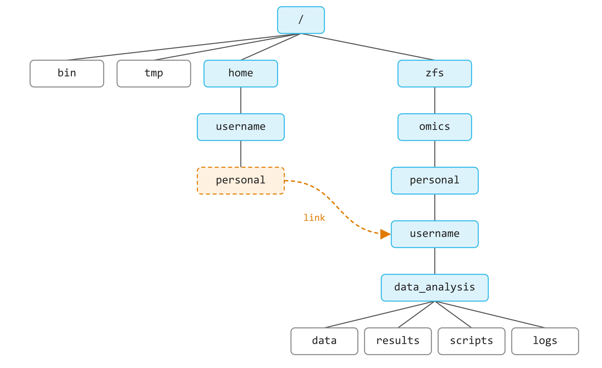
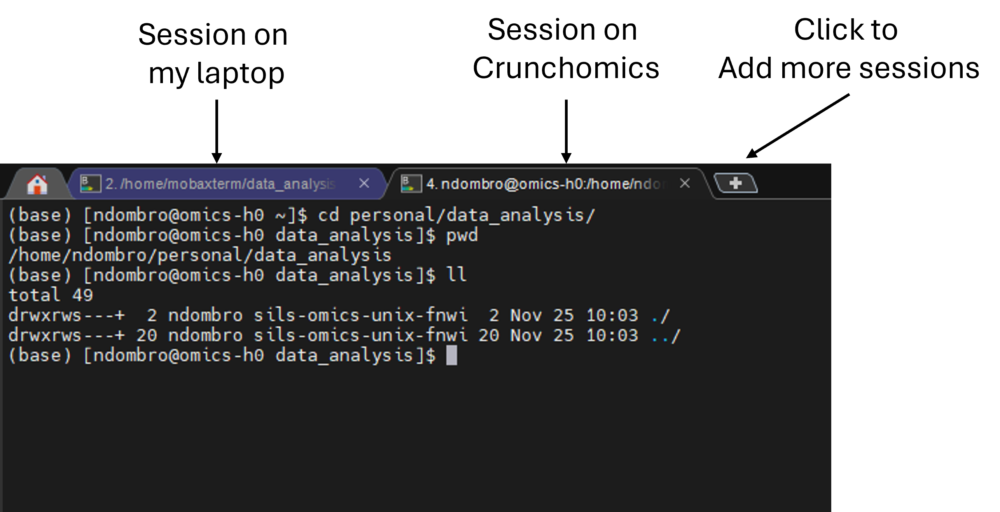
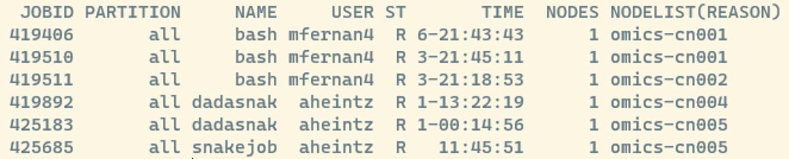
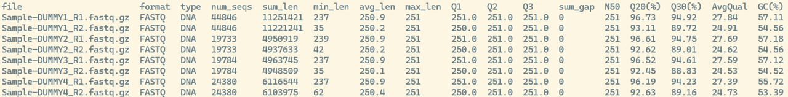
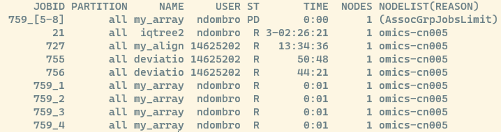
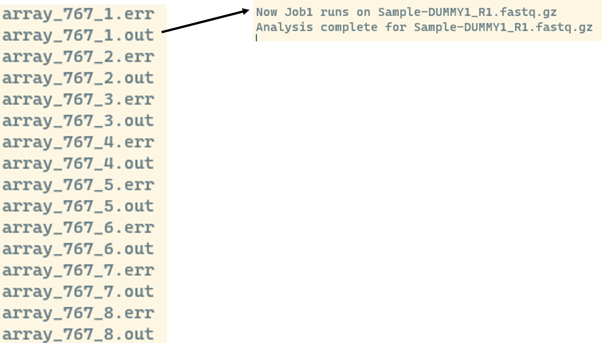

<div style="text-align: justify">

# Using an HPC

Now that you are more familiar with the command line, we will learn how to work on the UvA Crunchomics HPC. On this page, you will:

-   Connect to Crunchomics and prepare your account
-   Transfer the sequencing data from your own computer to Crunchomics
-   Run your first analyses on the compute nodes with SLURM:
    -   `srun` for short, interactive analyses
    -   `sbatch` for longer running, more resource intensive analyses
-   Install your own software with conda
-   Keep documenting what you do in the notebook (`notes.md`) that you started on day 1

For people following this tutorial outside of UvA:

-   If you have access to an HPC that uses SLURM, you can still follow the tutorial
-   If you do not have access to an HPC but are interested in how to install and run software that can be used to analyse sequencing data, you still might want to check out the steps below. The dataset is very small and all analyses can be run on a desktop computer

## Connecting to the HPC

### `ssh`: Connecting to a server

**SSH** (Secure Shell) is a network protocol that allows you to securely connect to a remote computer, such as the Crunchomics HPC. The general command looks like this:

```{bash}
ssh username@server
```

Here:

-   `username` is your account name on the HPC. For Crunchomics, this is your UvAnetID
-   `server` is the address of the HPC you want to connect to. For Crunchomics, this is `omics-h0.science.uva.nl`

To log in to Crunchomics, use the following command and enter your UvA password when you are asked for it. Remember that nothing appears on the screen while you type your password:

```{bash}
# Log in to Crunchomics (replace uvanetid with your own UvAnetID)
ssh uvanetid@omics-h0.science.uva.nl
```

You did the same during the [Before you start](installation.qmd) checks. After logging in, the prompt changes: it now shows your UvAnetID and `omics-h0`. Every command you type now runs on Crunchomics, not on your own computer.

::: callout-important
**Important tips for connecting:**

-   If you want to log in to Crunchomics while working from UvA, use the eduroam network, not the open Amsterdam Science Park network
-   If you are connecting from outside UvA, you must be connected to the VPN. Contact ICT if you have not set it up or encounter issues
-   Always double-check your username and the server address to avoid login errors
:::

::: {.callout-tip title="Tip: Viewing graphical output with ssh -X (optional)" collapse="true"}
Some programs on the HPC can open a window, for example to show a plot or a PDF. To see such windows on your own computer, log in with the `-X` option:

```{bash}
ssh -X uvanetid@omics-h0.science.uva.nl
```

`-X` enables what is called **X11 forwarding**: the HPC sends the graphical output to your computer. In this tutorial we don't need this, because we copy the results to our own computer instead.
:::

### Crunchomics: Preparing your account

If this is your **first time using Crunchomics**, you need to run a small bash script to set up your account. Ignore this section if you have done this before. The script:

-   Adds `/zfs/omics/software/bin` to your PATH. The **PATH** is the list of folders in which bash looks for programs. With this change, bash can find the software that is already installed on Crunchomics
-   Sets up a Python 3 environment with some useful Python packages
-   Creates a link called `personal` in your home directory. This link leads to your personal directory, which has 500 GB of space. Your home directory itself only has 25 GB

To set up your account, run the following commands:

```{bash}
# First, orient yourself
pwd
ls -lh

# Run the Crunchomics installation script
/zfs/omics/software/script/omics_install_script

# Check what changed
# You should now see the personal folder inside your home directory
ls -lh
```

After the script, `ls -lh` prints a line like this (your date and group name can differ):

```
lrwxrwxrwx.  1 username sils-omics-unix-fnwi 27 Sep  4  2023 personal -> /zfs/omics/personal/username
```

The arrow (`->`) tells you that `personal` is not a normal folder. We come back to this in the next section.

### Preparing your working directory

Next, let's make a project folder for our analyses. Always make project folders inside your personal directory, since it has much more space than your home directory. We give the folder the same name as on our own computer, `data_analysis`:

```{bash}
# Go into the personal folder
cd personal

# Make a new project folder and go into it
mkdir data_analysis
cd data_analysis

# Check that you are in the right folder
pwd
```

`pwd` prints `/home/username/personal/data_analysis`, so it looks like you are in your home directory. But your files are not stored there. `personal` is a **link** (also called a **symbolic link** or **symlink**): a shortcut that points to another folder, here `/zfs/omics/personal/username`. That is what the arrow in the `ls -lh` output showed. So `~/personal/data_analysis` and `/zfs/omics/personal/username/data_analysis` are two paths to the same folder:

<p align="center">



</p>

You now have a clean workspace for all the analyses that you will run on Crunchomics. As on your own computer, it is good practice to keep your raw data, results and scripts in separate folders.

### `scp`: Transferring data to and from a server

Next, we want to transfer the `data` folder with our sequencing data from our own computer to the new project folder on Crunchomics. We do this with `scp` (Secure Copy Protocol), which securely copies files and folders between your computer and a remote server.

The basic syntax is:

-   `scp [options] SOURCE DESTINATION`
-   A location on a server is written as `username@server:path_on_the_server`

When transferring data, you must **run `scp` in a terminal on your own computer**, not in a terminal that is logged in to the HPC. To keep yourself organized, it is useful to have two terminals open: one on your own computer and one on Crunchomics. In MobaXterm, you can open a second terminal in a new tab:

<p align="left">



</p>

To copy the entire `data` folder into your Crunchomics project folder, use:

```{bash}
# Run this in the terminal on your OWN computer (not on the HPC),
# from inside your local data_analysis folder (where the data folder is)
# Replace both instances of 'username' with your UvAnetID
scp -r data username@omics-h0.science.uva.nl:/home/username/personal/data_analysis
```

Here:

-   `-r` copies a folder together with everything inside it (**recursive**). Without `-r`, `scp` only copies single files
-   `data` is the source: the folder on your own computer
-   `username@omics-h0.science.uva.nl:/home/username/personal/data_analysis` is the destination: your project folder on Crunchomics

Now switch to the terminal that is logged in to Crunchomics and check that the files arrived:

```{bash}
# Run this on Crunchomics, inside the data_analysis folder
ls -l data/seq_project/*/*fastq.gz

# We expect 8 files (4 samples, R1 and R2 each)
ls data/seq_project/*/*fastq.gz | wc -l
```

::: {.callout-tip title="Tip: Moving data from the HPC to your own computer (optional)" collapse="true"}
You can also copy results from the HPC to your own computer. For this, you switch source and destination. For example, to copy a single sequencing file from Crunchomics:

-   We do not need `-r`, since we only copy a single file
-   We again run this command in a terminal on our own computer, not on the HPC
-   The `.` at the end means "copy into the folder I am in right now" on your own computer. If you want to copy the file elsewhere, replace `.` with a path

```{bash}
scp username@omics-h0.science.uva.nl:/home/username/personal/data_analysis/data/seq_project/barcode001_User1_ITS_1_L001/Sample-DUMMY1_R1.fastq.gz .
```
:::

::: {.callout-tip title="Tip: Moving files with wildcards (optional)" collapse="true"}
We can also copy several files at once with a wildcard. Then `scp` copies only the files, not the folders they are in.

```{bash}
# On Crunchomics: make a folder to copy the data into
mkdir transfer_test

# On your own computer: copy all fastq.gz files to the new folder on Crunchomics
scp data/seq_project/barcode00*/*fastq.gz username@omics-h0.science.uva.nl:/home/username/personal/data_analysis/transfer_test

# On Crunchomics: view the data
# See how the folder structure is different compared to our first example?
ls -l transfer_test/*
```

**Notice for Mac users**:

For Mac users who work with the zsh shell, the command above might not work, and you might get an error like "file not found", "no matches found" or something similar. That is because zsh handles wildcards slightly differently than bash. If you see this error and you are sure that the files exist, try this version of the command:

```{bash}
\scp data/seq_project/barcode00*/*fastq.gz username@omics-h0.science.uva.nl:/home/username/personal/data_analysis/transfer_test
```

If that does not work, these are some other things to try (different zsh setups might need slightly different solutions):

```{bash}
noglob scp data/seq_project/barcode00*/*fastq.gz username@omics-h0.science.uva.nl:/home/username/personal/data_analysis/transfer_test

scp 'data/seq_project/barcode00*/*fastq.gz' username@omics-h0.science.uva.nl:/home/username/personal/data_analysis/transfer_test
```
:::

::: {.callout-notebook .callout-note collapse="false" title="Notebook checkpoint: Setting up on Crunchomics"}
Today you keep writing in the same `notes.md` on your own computer. You copy the commands from the terminal that is logged in to Crunchomics into it.

Since you now work on two computers, your notebook needs to say **where** each command ran. Start every code block with a comment: `# On my computer` or `# On Crunchomics`.

Add a new heading `## Setting up on Crunchomics`, and below it:

1.  The command you used to log in
2.  The account setup with `omics_install_script`, with a note that this is only needed once
3.  The commands that made your project folder, and in normal text, where this folder is
4.  The `scp` command that copied the data, and the check that all files arrived

::: {.callout-notebook-answer .callout-note collapse="true" title="Compare with my notes"}
```` markdown
## Setting up on Crunchomics

```bash
# On my computer: log in to Crunchomics (on eduroam or with the VPN)
ssh uvanetid@omics-h0.science.uva.nl

# On Crunchomics: set up my account (only needed once)
# Adds the Crunchomics software to my PATH and makes the ~/personal link (500 GB)
#/zfs/omics/software/script/omics_install_script

# On Crunchomics: make the project folder inside my personal folder
cd ~/personal
mkdir data_analysis
```

My project folder on Crunchomics is `~/personal/data_analysis`, with the same name as on my computer.

```bash
# On my computer, inside my local data_analysis folder: copy the data to Crunchomics
scp -r data uvanetid@omics-h0.science.uva.nl:/home/uvanetid/personal/data_analysis

# On Crunchomics, inside data_analysis: check that all 8 fastq.gz files arrived
ls data/seq_project/*/*fastq.gz | wc -l
```
````
:::
:::


## Submitting jobs with SLURM

### Login node and compute nodes

In the HPC introduction, you learned that an HPC has two main parts:

-   The **login node**: where you log in and do light work, such as moving files, editing scripts or preparing jobs
-   The **compute nodes**: where the actual analyses run. These nodes have more CPUs and memory

We do not run big analyses on the login node. Instead, we send them to the compute nodes as **jobs**. A job is a task that you ask the HPC to run, together with the resources it needs. The jobs are managed by **SLURM**, a workload manager that decides *when*, *where* and *how* your jobs run based on the available resources.


### `squeue`: View the jobs in the queue

The command below shows you which jobs are currently running or waiting in the queue:

```{bash}
squeue
```

This shows all jobs on the system and might look something like this:

{width="50%" fig-align="left"}

Some useful columns to know:

-   JOBID: a unique number for each job. You can use it to check on or cancel a job later
-   ST: the current state of the job, e.g. R = running, PD = pending (waiting). A full list of SLURM job state codes can be found [here](https://curc.readthedocs.io/en/latest/running-jobs/squeue-status-codes.html)

Once you have submitted a job, it appears in this list as well. To see only your own jobs, add the `-u` option followed by your user name. `$USER` is a shortcut that bash replaces with your own user name:

```{bash}
squeue -u $USER
```

### `srun`: Submitting a job interactively

Now let's run our first job on a compute node. There are two main ways to submit jobs: `srun` and `sbatch`. We start with `srun`, which you typically use when:

-   You want to run tasks **interactively** and see the output directly on your screen
-   You are **testing or debugging** your commands before writing a job script
-   You have **short jobs** (usually less than a few hours)

Let's start with a very simple example to see how `srun` works:

```{bash}
srun --cpus-per-task=1 --mem=1G --time=00:10:00 echo "Hello world"
```

Here's what each part means:

-   `srun`: tells SLURM that you want to run something on a compute node, with the resources that follow
-   `--cpus-per-task=1`: request 1 CPU
-   `--mem=1G`: request 1 GB of memory
-   `--time=00:10:00`: set a maximum run time of 10 minutes (hours:minutes:seconds). If the job takes longer, SLURM stops it
-   `echo "Hello world"`: the actual command to run

So everything between `srun` and the actual command tells SLURM which resources your job needs on the compute node. The job runs so fast that you won't see it in `squeue`. But congratulations, after submitting this, you just communicated with a compute node for the first time.

::: callout-important
Jobs started with `srun` stop if you lose the connection to the HPC, for example when you close your laptop. For longer jobs, use `sbatch` (see below).
:::

### Run seqkit stats with `srun`

Next, let's use `srun` for something more useful. [SeqKit](https://bioinf.shenwei.me/seqkit/) is a toolkit for working with sequence files, and it is already installed on Crunchomics (version 2.7.0). Its command `seqkit stats` gives a summary of each fastq file: how many reads it has, how long they are, and how good their quality is. We use it to get a first overview of the sequencing data that we just copied to Crunchomics.

Whenever you use a tool for the first time, check its help page (e.g. `seqkit stats -h`) to see all available options, or look online for a manual.

```{bash}
# Make a results folder with a seqkit folder inside
mkdir -p results/seqkit

# Run seqkit stats on all fastq.gz files with srun
srun --cpus-per-task=1 --mem=5G --time=00:30:00 seqkit stats -b -a -T -o results/seqkit/stats_raw.txt data/seq_project/*/*gz --threads 1

# Check the output: we expect one table with a header line and one line per fastq.gz file
wc -l results/seqkit/stats_raw.txt
```

Here:

-   `seqkit stats data/seq_project/*/*gz`: run `seqkit stats` on all files in the `seq_project` folders that end with `gz`
-   `-b`: only output the basename of files instead of printing the relative path to the fastq.gz files
-   `-a`: print all statistics. Without it, seqkit prints only the basic ones, such as the number and length of the reads, but not their quality
-   `-T`: print the output as a table in which the columns are separated by tabs. This format is easy to read for other commands, such as `cut`
-   `-o results/seqkit/stats_raw.txt`: write the output into this file.
-   `--threads 1`: let seqkit use 1 CPU (in our case, thread and CPU mean the same)
    -   **Important**: always make sure that the number of CPUs you request from SLURM matches the number of CPUs (threads) the software uses. If the tool uses more than you requested, it competes with itself for CPUs. If you request more than the tool uses, the extra CPUs sit idle while others could use them

Since we work with little data, this runs fast despite only using 1 CPU. It may even finish within a few seconds. If you are logged in to Crunchomics in a second terminal and run `squeue` while your job is running, you should see it (in the example below, the job is named after the software and got the job ID 379646):

{width="50%" fig-align="left"}

It is a good habit to look at the outputs of whatever software to run, not only to understand your data but also to make sure that the software ran correctly:

```{bash}
cat results/seqkit/stats_raw.txt
```

The output should look like this:

{width="100%" fig-align="left"}

The most useful columns for us are:

-   `num_seqs`: the number of reads in the file
-   `min_len`, `avg_len` and `max_len`: the shortest, average and longest read length
-   `Q20(%)` and `Q30(%)`: the percentage of bases with a quality score of at least 20 or 30. A quality score of 20 means that there is a 1 in 100 chance that the base is wrong, a score of 30 a 1 in 1000 chance
-   `GC(%)`: the percentage of G and C bases

::: {.callout-tip title="Tip: FastQC for visual quality reports (optional)" collapse="true"}
`seqkit stats` gives us summary numbers, which might not be enough to accurately assess our data. Another very common tool for a more detailed, visual check of sequencing quality is [FastQC](https://www.bioinformatics.babraham.ac.uk/projects/fastqc/), which is also installed on Crunchomics. It makes one HTML report per fastq file, with plots of the quality along the reads. You open these reports in the internet browser of your own computer, so you first copy them with `scp`. [MultiQC](https://seqera.io/multiqc/) can combine many of these reports into one.
:::

::: {.callout-question .callout-warning collapse="false" title="Exercise"}
1.  On day 1, we counted the lines in each fastq file (`results/counts/line_counts_bash.txt` on your own computer). Use this to work out how many reads `Sample-DUMMY1_R2.fastq.gz` has. Does this match `num_seqs` in the seqkit table?
2.  Look at `num_seqs` for the R1 and the R2 file of each sample. What do you notice?
3.  Use `cut` to print only the columns `file` and `num_seqs` of the table

::: {.callout-answer .callout-warning collapse="true" title="Click me to see an answer"}
```{bash}
# Question 1:
# On your own computer 
# Sample-DUMMY1_R2 has 179384 lines
cat results/counts/line_counts_bash.txt

# On Crunchomics
# Sample-DUMMY1_R2 has 44846 seqs
cat results/seqkit/stats_raw.txt

# Question 3:
# file is the 1st column and num_seqs is the 4th column
# cut uses tabs to split columns by default, so we don't need -d here
cut -f1,4 results/seqkit/stats_raw.txt
```

For question 1: each read takes up 4 lines in a fastq file, so the number of reads is the number of lines divided by 4. `Sample-DUMMY1_R2.fastq.gz` has 179,384 lines, which is 44,846 reads. seqkit reports the same number. When two different methods give the same answer, we can trust the result a lot more.

For question 2: the R1 and R2 file of the same sample always have the same number of reads. Each read in R1 has its partner read in R2. This is what you expect for paired end sequencing data and is a good sanity check to implement to ensure that your sequence data is not corrupted.
:::
:::


::: {.callout-tip title="Tip: Working interactively on a compute node (optional)" collapse="true"}
Sometimes you want to try out several commands after each other on a compute node, for example to test a new tool. Instead of putting `srun` in front of every command, you can open an **interactive session**: a shell that runs on a compute node.

```{bash}
# Open an interactive bash shell on a compute node for at most 1 hour
srun --cpus-per-task=1 --mem=5G --time=01:00:00 --pty bash -i
```

Here:

-   `--pty bash -i` starts an interactive bash shell on the compute node, instead of running a single command

Once you ran this, you will see that your prompt changed: it now shows the name of the compute node instead of `omics-h0`. You can check where you are with the command `hostname`, which prints the name of the computer you are working on. Every command you type now runs on the compute node, with the resources you requested.

When you are done, leave the compute node and go back to the login node:

```{bash}
exit
```

::: callout-important
Always `exit` an interactive session when you are done. As long as the session is open, the CPUs and memory you requested stay reserved for you, even if you don't use them, and other people have to wait for them.
:::
:::


::: {.callout-tip title="Tip: Keeping srun jobs running with screen (optional)" collapse="true"}
`srun` has two downsides for jobs that run for a long time: you can't use your terminal while the job runs, and the job stops if you lose the connection to the HPC, for example when you close your laptop. There are two ways around this:

1.  Use `sbatch` (see below)
2.  Run the `srun` command inside `screen`

`screen` opens a terminal that keeps running on Crunchomics, even when you are not connected. Such a terminal is called a **screen session**. You can leave a session and come back to it later, and everything that runs inside it continues in the meantime, as long as Crunchomics itself is running.

To start a screen session:

```{bash}
screen
```

We **detach** from a screen (go outside of it but keep it running in the background) by pressing `Ctrl+a` and then `d`.

If you want to run several analyses in several screens at the same time, it is useful to give your screens descriptive names with the `-S` option:

```{bash}
screen -S run_seqkit
```

After detaching from this screen again with `Ctrl+a` and then `d`, you can list all running screens with:

```{bash}
screen -ls
```

You can reconnect to an existing screen like this:

```{bash}
screen -r run_seqkit
```

Inside the screen, we can run `seqkit stats` the same way as before, but now we don't risk losing a long-running job:

```{bash}
srun --cpus-per-task=1 --mem=5G --time=00:30:00 seqkit stats -b -a -T -o results/seqkit/stats_raw.txt data/seq_project/*/*gz --threads 1
```

If you want to completely close and remove a screen, type the following and press enter while you are inside the screen:

```{bash}
exit
```
:::


### `sbatch`: Submitting a long-running job

While `srun` is great for quick, interactive runs, most analyses on an HPC are submitted with **`sbatch`**. With `sbatch`, you write your commands into a **job script**, a text file with all the commands and the resources your job needs. SLURM then runs the script in the background, even after you log out.

Use `sbatch` when:

-   You have **long or resource-intensive** analyses
-   You want jobs to run **unattended**, without your direct supervision
-   You want to **run several jobs** after each other or at the same time

#### Step 1: Create folders for scripts and logs

We keep our project tidy by making separate folders for our job scripts and for the log files that SLURM writes:

```{bash}
mkdir -p scripts logs

# Check that the folders are there
ls -l
```

#### Step 2: Write a job script

We run `seqkit stats` again, but this time with `sbatch` instead of `srun`, so that you can directly compare the two.

Use `nano` to create a script file:

```{bash}
nano scripts/seqkit.sh
```

Then add the following content inside that file:

```{bash}
#!/bin/bash
#SBATCH --job-name=seqkit
#SBATCH --output=logs/seqkit_%j.out
#SBATCH --error=logs/seqkit_%j.err
#SBATCH --cpus-per-task=1
#SBATCH --mem=5G
#SBATCH --time=01:00:00

echo "seqkit job started on:"
date

seqkit stats -b -a -T -o results/seqkit/stats_raw.txt data/seq_project/*/*gz --threads 1

echo "seqkit job finished on:"
date
```

Save and exit:

-   Press `Ctrl+X` to exit, then `Y` to confirm that you want to save the file, then Enter to keep the file name

Notice how the `seqkit stats` command looks exactly the same as when we used `srun`? The main difference between `srun` and `sbatch` is how we package the instructions for the compute node.

#### Step 3: Understanding your job script

In the job script above:

-   `#!/bin/bash`: this so-called **shebang** line tells the system to run the script with bash. Add it at the very top of every job script
-   `#SBATCH --...`: these lines tell SLURM which resources the job needs and how to name things. They are the same options that you used with `srun`, plus three new ones:
    -   `--job-name`: a name for your job, which you see in `squeue`
    -   `--output`: the file in which SLURM stores everything the job prints to the screen (the **standard output**)
    -   `--error`: the file in which SLURM stores error messages (the **standard error**)
    -   `%j` in the file names is replaced by the job ID. This way, every job gets its own log files and nothing is overwritten
-   `echo` and `date`: print messages with the time, so that you can follow the progress of the job in the log file
-   `seqkit stats ...`: the actual analysis that runs on the compute node

Notice that the `#SBATCH` lines start with `#`? For bash, these lines are comments. Only SLURM reads them.

#### Step 4: Submit and monitor your job

```{bash}
# Submit the job script to SLURM
sbatch scripts/seqkit.sh

# Check the job status (the job may run too fast to appear)
squeue -u $USER

# Once the job is finished and no longer in the list, check the outputs
ls -l logs
ls -l results/seqkit
```

When the job is submitted, you see something like `Submitted batch job 754`, and two new log files appear in your `logs` folder:

-   `seqkit_<jobID>.out`: the standard output, e.g. the messages from `echo` and `date`
-   `seqkit_<jobID>.err`: the error log. Check this file if your job fails

Have a look at both log files, for example with `cat logs/seqkit_*.out`. Do you see the messages from `echo` and `date`? Some programs also write normal progress messages into the error log, so a `.err` file with content does not always mean that something went wrong.

Since we gave seqkit the same output file name, the table from the `srun` run was replaced by the new one. Look at the time in `ls -l results/seqkit` to see this. Here that is fine, because the input is the same. With real data, overwriting results by accident can cost you hours of work, so choose your output names with care.

::: {.callout-tip title="Tip: Debugging your first sbatch jobs" collapse="false"}
If your job fails:

-   Check the `.err` and `.out` files in the `logs` folder. These files usually tell you what went wrong
-   Check that your input files and paths exist, e.g. with `ls`. The job runs from the folder in which you typed `sbatch`, so relative paths start from there
-   Try to run the main command interactively with `srun` first. If it works there, it should also work in a script
:::

#### Step 5: `scancel`: Cancelling a job

Sometimes you realize that a job is stuck, misconfigured or uses the wrong resources. You can cancel it with `scancel` and the job ID:

```{bash}
scancel <jobID>
```

For example, if your job ID was 754:

```{bash}
scancel 754
```

::: {.callout-tip title="Tip: Good HPC etiquette" collapse="false"}
Always cancel jobs that run incorrectly or that you no longer need. This frees resources for others and avoids unnecessary load on the cluster.
:::

::: {.callout-notebook .callout-note collapse="false" title="Notebook checkpoint: Read statistics with seqkit"}
Add a new heading `## Read statistics with seqkit` to `notes.md`, and below it:

1.  Which tool you used, and which version. Run `seqkit version` to find out, and write the version in the comment above the command
2.  The `sbatch` command, with a comment that names the script and the file it makes. Below the code block, write down the job ID that `sbatch` printed (`Submitted batch job ...`). The job ID is also part of the names of the log files, so with it you can find the logs of this run later
3.  We ran seqkit twice, first with `srun` and then with `sbatch`, and the second run replaced the table of the first one. Write down which run made the table that is there now
4.  Below the code block: does the number of reads of `Sample-DUMMY1_R2` match your count from day 1?

You don't need to copy the content of the job script into your notebook. It is saved in `scripts/seqkit.sh`, and at the end of the day, we copy it to your own computer.
:::

### Choosing the right amount of resources

When you are just starting, choosing the right amount of CPUs, memory and run time can be tricky. The resources a job needs vary a lot between tools and datasets. Here are a few rules of thumb:

-   **Start small**: a lot of tools don't need huge resources, especially for small test runs
-   **Check the tool's documentation**: some tools recommend resource settings
-   **Test with a small dataset first**: a subset of your data runs faster and helps you find and fix problems
-   **Be careful with how memory is counted**: `--mem=4G` asks for 4 GB in total for your job, no matter how many CPUs you request. `--mem-per-cpu=4G` instead asks for 4 GB for each CPU, so `--cpus-per-task=4 --mem-per-cpu=4G` gives you a total of 16 GB of memory (4 CPUs \* 4 GB)

Remember: requesting more resources than you need makes your jobs wait longer in the queue and can block others from running.

If you want to know how much a finished job actually used, have a look at the optional `sacct` box below.

::: {.callout-tip title="Tip: Checking the resources a job used with sacct (optional)" collapse="true"}
After a job has finished, you can check which resources it actually used with `sacct`. Replace `379723` with the job ID of your seqkit job:

```{bash}
sacct -j 379723 --format=User,JobID,JobName,State,Start,End,Elapsed,MaxRSS,NCPUS
```

Here:

-   `-j 379723`: show the information for job 379723
-   `--format=...`: choose which columns to show. The most useful ones are:
    -   `State`: whether the job finished successfully (COMPLETED) or not (e.g. FAILED, CANCELLED, TIMEOUT)
    -   `Elapsed`: how long the job ran
    -   `MaxRSS`: the maximum amount of memory the job used. Compare this with the memory you requested with `--mem`
    -   `NCPUS`: the number of CPUs the job had

How to use this information:

-   **Compare what your job used with what you requested**: if you plan to run similar jobs over and over again, adjust your requests
-   **Adjust step by step**: if your job fails or runs out of memory or time, increase the resources gradually
:::

## `conda`: Installing your own software

Crunchomics already has a lot of software installed, but it doesn't have every tool, and not always comes with the version you need. Let's look at fastp, the tool we use in the next section:

```{bash}
# Which fastp does bash find, and which version is it?
which fastp
fastp --version
```

We see that fastp is installed on Crunchomics and that it comes with version 1.0.1. If we search online, we can find that the newest version is 1.4.0 (at least when I checked in October 2026). Newer versions fix errors and add features, and the version you use can change your results. That is why you should always write down which version of a tool you used, and why you sometimes want to install a specific version yourself.

You can't install software into the shared software folders of Crunchomics, because you don't have administrator rights there. However, we can use **conda**: a program that installs software into your own folders, without administrator rights. **mamba** does the same as conda, but faster. It understands the same commands, so you can swap `conda` and `mamba` in almost all commands that you find online.

conda installs each tool into its own **environment**: a separate folder with the tool and all the other programs it needs, in exactly the right versions. This way, tools that need different versions of the same program don't get in each other's way. To use a tool, you **activate** its environment. Activating adds the environment's folder to the front of your PATH (remember, the list of folders in which bash looks for programs), so bash finds the tool there first.

### Install Miniforge

First, check if you already have conda or mamba:

```{bash}
conda --version
mamba --version
```

If both commands print a version number, then conda is already installed, and you can skip to the next section. If they print nothing or an error message (for example one that contains `no conda in`), install **Miniforge**, a small installer that contains conda and mamba.

::: {.callout-important title="Important: Install Miniforge into your personal folder, not into your home folder" collapse="false"}
Your home folder on Crunchomics has only 25 GB of space, and conda environments can take up several GB once you have a few of them. So we install Miniforge into your personal folder, which has 500 GB: `/zfs/omics/personal/$USER/miniforge3`.

`$USER` is a variable that bash has already set for you. It contains your user name, so for you, `$USER` is replaced by your UvAnetID. That way, you can copy the commands below exactly as they are.
:::

Installing Miniforge is a small job, so it is fine to run it on the login node. Run the commands one by one:

<!-- TO CHECK in the test run: the installer name Miniforge3-Linux-x86_64.sh fits Crunchomics (uname -m prints x86_64). -->

```{bash}
# Go into your personal folder
cd /zfs/omics/personal/$USER

# Download the Miniforge installer
curl -L -O https://github.com/conda-forge/miniforge/releases/latest/download/Miniforge3-Linux-x86_64.sh

# Check that the installer was downloaded
ls -lh Miniforge3-Linux-x86_64.sh

# Run the installer
# -b: install without asking any questions
# -p: define the folder to install Miniforge into
bash Miniforge3-Linux-x86_64.sh -b -p /zfs/omics/personal/$USER/miniforge3

# Check that the folder was created
ls /zfs/omics/personal/$USER/miniforge3
```

Here:

-   `curl -L -O`: downloads the installer, like on day 1. Crunchomics is a Linux computer with an x86_64 processor, so we download the installer for that system
-   `-b`: runs the installer without questions. Without `-b`, the installer asks you to read the license and to type the folder for the installation yourself. Typing that folder by hand is easy to get wrong, which is why we give it with `-p` instead
-   By using `-b`, you accept the [Miniforge license](https://github.com/conda-forge/miniforge/blob/main/LICENSE) without seeing it. The installer itself has a BSD-3-Clause license, and the programs that come with it have their own licenses. Have a look at it if you want to know what you agree to

The installer has now put conda into your personal folder, but bash does not know about it yet. The next command adds a few lines to your `~/.bashrc` file. This file contains settings that bash reads every time you log in. By adding the lines below, bash can find conda from now on:

```{bash}
# Set up conda for bash (only needed once)
/zfs/omics/personal/$USER/miniforge3/bin/conda init

# Read the new settings without logging out and in again
source ~/.bashrc

# Check that bash now finds conda and mamba
conda --version
mamba --version
```

`conda init` prints a long list of files, most of them with "no change". That is fine. The output also tells you to close and re-open your shell. `source ~/.bashrc` does the same thing, so you don't have to log out.

You should now see `(base)` at the start of your prompt. This shows that conda is active, and that you are in its **base** environment, the environment that comes with Miniforge.

### `mamba create`: Make an environment with fastp

Now we can install fastp 1.4.0 into a new environment. We put the version number into the name of the environment, so that we can see later which version it contains:

```{bash}
# Make a new environment called fastp_1.4.0 and install fastp version 1.4.0 into it
# Press Y and Enter when mamba asks you to confirm
mamba create -n fastp_1.4.0 -c bioconda fastp=1.4.0
```

Here:

-   `-n fastp_1.4.0`: the name of the new environment
-   `-c bioconda`: where to look for the software. Bioconda is a collection (a **channel**) with thousands of bioinformatics tools. You can search for tools and versions on [anaconda.org](https://anaconda.org/bioconda)
-   `fastp=1.4.0`: the tool to install, and the exact version. Without `=1.4.0`, mamba installs the newest version, which might be a different one the next time you run the same command

Let's use the new environment:

```{bash}
# Activate the environment
conda activate fastp_1.4.0

# Check which fastp bash finds now, and its version
which fastp
fastp --version

# Leave the environment again
conda deactivate

# Check which fastp bash finds now
which fastp
```

When the environment is active, you see `(fastp_1.4.0)` at the start of your prompt, and `which fastp` shows a path inside your `miniforge3` folder. After `conda deactivate`, bash finds the fastp of Crunchomics again.

**Recommendations**:

-   Keep the base environment clean: make a new environment for each tool, instead of installing everything into base
-   Always install a specific version (`tool=version`), and put the version number in the name of the environment
-   Check the documentation of a tool for installation notes or version requirements
-   List all your environments with `conda env list`
-   Remove an environment that you no longer need with `conda env remove -n name_of_the_environment`

::: {.callout-question .callout-warning collapse="false" title="Exercise"}
1.  List all conda environments that you have now
2.  Activate the fastp environment again. In which folder is the fastp program located? Keep the environment active for the next section

::: {.callout-answer .callout-warning collapse="true" title="Click me to see an answer"}
```{bash}
# Question 1:
conda env list

# Question 2:
conda activate fastp_1.4.0
which fastp
```

You should see two environments in the list: `base` and `fastp_1.4.0`. The fastp program is in the `bin` folder of the environment, inside your `miniforge3` folder.
:::
:::

::: {.callout-notebook .callout-note collapse="false" title="Notebook checkpoint: Installing fastp"}
Software gets its own place in your notebook: near the **top**, below the short description. Someone who wants to repeat your analysis then sees right away what they need to install first.

Add a heading `## Software` below the description at the top of `notes.md`, and below it:

1.  The tools that were already installed on Crunchomics, with their version (seqkit)
2.  Where you installed Miniforge, and that you ran `conda init` (only needed once)
3.  The `mamba create` command, and the name of the environment
:::

## fastp: Running a tool for each sample with a for-loop

With `seqkit stats`, we were lucky: we could give it all fastq files at once with a wildcard. Many tools don't work this way and instead work on one sample at a time. [fastp](https://github.com/OpenGene/fastp) is such a tool. It removes low-quality parts of reads and leftover adapter sequences, which is called **trimming** or **quality filtering**. For paired-end data, fastp needs the R1 and the R2 file of the same sample together.

To run fastp on all our samples, we combine three things from day 1: `cut` to make a list of samples, a for-loop to repeat the command for each sample, and a script file to run the loop as a job. We build the loop step by step, and look at what happens after each step.

If it is not active yet, activate the conda environment with fastp that we made in the previous section:

```{bash}
conda activate fastp_1.4.0
```

### Step 1: Run fastp on one sample

Before we write a loop, we run the tool on a single sample. This shows us what fastp needs as input and what it produces. Like for every new tool, start with the help page:

```{bash}
fastp --help
```

Now let's run fastp on Sample-DUMMY1:

```{bash}
# Make a folder for the fastp results
mkdir -p results/fastp

# Run fastp on the R1 and R2 file of the first sample
srun --cpus-per-task=2 --mem=5G --time=00:30:00 fastp \
    -i data/seq_project/barcode001_User1_ITS_1_L001/Sample-DUMMY1_R1.fastq.gz \
    -I data/seq_project/barcode001_User1_ITS_1_L001/Sample-DUMMY1_R2.fastq.gz \
    -o results/fastp/Sample-DUMMY1_R1.trimmed.fastq.gz \
    -O results/fastp/Sample-DUMMY1_R2.trimmed.fastq.gz \
    --thread 2

# Check what fastp made, in the results folder and in the current folder
ls -l results/fastp
ls -l
```

This command is long, so we split it over several lines to make it more readable. The `\` at the end of a line tells bash that the command continues on the next line. Be careful: the `\` must be the very last character on the line, so don't add a space after it.

Here:

-   `-i` and `-I`: the R1 and R2 input files
-   `-o` and `-O`: where to write the trimmed R1 and R2 files
-   `--thread 2`: let fastp use 2 CPUs, the same number that we requested from SLURM with `--cpus-per-task=2`

When fastp is done, it prints a summary to the screen. It shows, for example, how many reads there were before and after filtering.

Now look at the output of the two `ls` commands. The trimmed files are in `results/fastp`, as we asked. But fastp also made two reports, `fastp.html` and `fastp.json`, and put them in the folder we ran the command from. We never asked for these names and fastp uses them by default. If we now ran fastp on the next sample, it would write its reports under the same names, and overwrite the reports of Sample-DUMMY1.

This is why it is worth running a tool on one sample first and looking carefully at the help page. In the help page, we find the options `-h` and `-j` to choose the names of the two reports ourselves. We use them in the loop below. The reports in the current folder are not needed anymore, so we remove them:

```{bash}
# Remove the two reports with the default names
rm fastp.html fastp.json

# Check that they are gone
ls -l
```

### Step 2: Make a list of samples

Our loop will repeat fastp once per sample, so we need a list with the 4 sample names. We build this list from the file names with `cut`, step by step:

```{bash}
# List the R1 files only. Each sample has exactly one R1 file, so each sample is listed once
ls data/seq_project/*/*_R1.fastq.gz

# Keep only the file name: the 4th field when we split the path at each /
ls data/seq_project/*/*_R1.fastq.gz | cut -f4 -d "/"

# Keep only the sample name: the 1st field when we split the file name at each _
ls data/seq_project/*/*_R1.fastq.gz | cut -f4 -d "/" | cut -f1 -d "_"
```

The last command prints exactly the list we want, so we store it in a file:

```{bash}
ls data/seq_project/*/*_R1.fastq.gz | cut -f4 -d "/" | cut -f1 -d "_" > samples.txt

# Check the list: we expect 4 sample names
cat samples.txt
wc -l samples.txt
```

A list file like `samples.txt` has a few advantages. You can open it and see exactly which samples the loop will work on. And if you later want to rerun only some samples, you can make a shorter list without changing the loop.

::: {.callout-tip title="Tip: Making a list file by hand (optional)" collapse="true"}
You can also type a list file yourself, one sample name per line. Use `nano` for this, not Notepad or Word. As we saw on day 1, Windows programs add an invisible character at the end of each line. In a list file, this character becomes part of each sample name, and the loop then looks for files that don't exist.
:::

### Step 3: Build the loop with `echo`

Like on day 1, we start with a loop that only prints what it works on:

```{bash}
for sample in $(cat samples.txt); do
    echo $sample
done
```

This should print the 4 sample names. One part is new here: `$(cat samples.txt)`. `cat samples.txt` prints the content of the file. The `$( )` around it takes this printed text and puts it into the command, at the place where it stands. This is called **command substitution**. So for bash, the first line becomes `for sample in Sample-DUMMY1 Sample-DUMMY2 Sample-DUMMY3 Sample-DUMMY4; do`.

Important: Bash splits the text from `samples.txt` at every new line, but also at every space. So each line in the list file must contain one name, without spaces.

Next, we check that we find the right input files for each sample. We use `ls` instead of `echo`, because `ls` shows us which files the wildcard actually matches:

```{bash}
for sample in $(cat samples.txt); do
    echo "Sample: $sample"
    ls data/seq_project/*/${sample}_R1.fastq.gz
    ls data/seq_project/*/${sample}_R2.fastq.gz
done
```

Each `ls` should print exactly **one** file. This is the moment to check what your wildcard matches. Imagine you had sequenced Sample-DUMMY1 twice, and had two folders with a `Sample-DUMMY1_R1.fastq.gz` file. Then the wildcard would match both files, and fastp would get the wrong input. Always look at what a wildcard matches before you give it to a tool.

Notice that we write `${sample}`, with curly brackets, and not `$sample`. The curly brackets show bash where the variable name ends. Without them, bash reads `$sample_R1` as a variable called `sample_R1`. That variable doesn't exist, so bash quietly replaces it with nothing, and the path becomes `data/seq_project/*/.fastq.gz`. Bash does not give an error for this. Use the curly brackets whenever text follows directly after a variable name.

### Step 4: A dry run of the full command

Now we put the whole fastp command into the loop, but with `echo` in front of it. Bash then prints each command instead of running it. We add `-h` and `-j` to give each sample its own reports:

```{bash}
for sample in $(cat samples.txt); do
    echo "" 
    echo fastp \
        -i data/seq_project/*/${sample}_R1.fastq.gz \
        -I data/seq_project/*/${sample}_R2.fastq.gz \
        -o results/fastp/${sample}_R1.trimmed.fastq.gz \
        -O results/fastp/${sample}_R2.trimmed.fastq.gz \
        -h results/fastp/${sample}.html \
        -j results/fastp/${sample}.json \
        --thread 2
done
```

This prints 4 fastp commands, one per sample. Read them carefully: do the R1 and R2 input files belong to the same sample? Does every sample get its own output names? If something looks wrong, it is much easier to fix it now than after the job has run.

::: {.callout-important title="Important: Don't put quotes around a path with a wildcard" collapse="false"}
In scripts that you find online, or that an AI tool writes for you, variables are often written in quotes, for example `"$sample"`. That is a good habit in general. But be careful with wildcards. Inside quotes, bash does not replace the `*` with the matching file names. With `-i "data/seq_project/*/${sample}_R1.fastq.gz"`, fastp would look for a folder that is literally called `*`, and stop with an error.

That is why we write the input paths without quotes, directly in the fastp command. Our names contain no spaces, so this is safe here.

The `scp` command in the exercise below, where we copy the fastp reports to our own computer, is the opposite case. There, we put quotes around the wildcard on purpose: the quotes stop your own computer from using the wildcard, so that Crunchomics can use it to find the files.
:::

### Step 5: Run the loop as a job

The loop works, so we can run it for real. Our 4 samples are small, but with real data this can take hours, so we submit the loop as a job with `sbatch`. Create a new script:

```{bash}
nano scripts/fastp.sh
```

And add the following content:

```{bash}
#!/bin/bash
#SBATCH --job-name=fastp
#SBATCH --output=logs/fastp_%j.out
#SBATCH --error=logs/fastp_%j.err
#SBATCH --cpus-per-task=2
#SBATCH --mem=5G
#SBATCH --time=01:00:00

# Make conda available in the job, and activate the environment with fastp
source ~/.bashrc
conda activate fastp_1.4.0

# Make the output folder (no error if it already exists)
mkdir -p results/fastp

# Run fastp on the R1 and R2 file of each sample in samples.txt
for sample in $(cat samples.txt); do
    echo "Start fastp for: $sample"

    fastp \
        -i data/seq_project/*/${sample}_R1.fastq.gz \
        -I data/seq_project/*/${sample}_R2.fastq.gz \
        -o results/fastp/${sample}_R1.trimmed.fastq.gz \
        -O results/fastp/${sample}_R2.trimmed.fastq.gz \
        -h results/fastp/${sample}.html \
        -j results/fastp/${sample}.json \
        --thread 2
done

echo "fastp job finished on:"
date
```

Save and exit with `Ctrl+X`, `Y` and Enter.

The loop is the same as in our dry run, only without `echo` in front of fastp. Two parts are new compared to the seqkit job script:

-   `source ~/.bashrc` and `conda activate fastp_1.4.0`: a job starts in a fresh environment on a compute node, where conda is not set up yet. `source ~/.bashrc` runs the settings from your `~/.bashrc` file, which include the setup of conda. After that, we can activate the environment with fastp.
-   `echo "Start fastp for: $sample"`: writes the sample name into the log file before fastp starts. If something goes wrong, you can see in the log at which sample it happened.

Submit the job and follow it:

```{bash}
# Submit the job script to SLURM
sbatch scripts/fastp.sh

# Check the job status
squeue -u $USER

# Once the job is done, look at the log files
cat logs/fastp_*.out
less logs/fastp_*.err
```

fastp prints its summary for each sample into the log files. Have a look at both of them.

### Step 6: Check the output

Never assume that a job did what you wanted, just because it finished. We gave 4 samples to fastp, and for each sample we expect 2 trimmed files, 1 HTML report and 1 JSON report:

```{bash}
# Look at the output files
ls -l results/fastp

# Count them: we expect 4 samples x 4 files = 16 files
ls results/fastp | wc -l
```

Also check that none of the files is empty (a size of 0 in the `ls -l` output), and that each sample name appears in the `.out` log.

::: {.callout-question .callout-warning collapse="false" title="Exercise"}
1.  Copy the 4 HTML reports to your own computer and open the report for Sample-DUMMY1
2.  On day 1, we counted the lines in each fastq file (`results/counts/line_counts_bash.txt` on your own computer). How many reads did Sample-DUMMY1 have before filtering? Does this match the number in the fastp report?
3.  Count the lines in `results/fastp/Sample-DUMMY1_R1.trimmed.fastq.gz` on Crunchomics. How many reads are left after filtering?

::: {.callout-answer .callout-warning collapse="true" title="Click me to see an answer"}
```{bash}
# Question 1:
# Run this in the terminal on your OWN computer, from inside your local data_analysis folder
mkdir -p results/fastp
scp 'username@omics-h0.science.uva.nl:/home/username/personal/data_analysis/results/fastp/*html' results/fastp/
ls -l results/fastp

# Question 2:
# On your own computer
cat results/counts/line_counts_bash.txt

# Question 3:
# On Crunchomics
zcat results/fastp/Sample-DUMMY1_R1.trimmed.fastq.gz | wc -l
```

For question 2: each read takes up 4 lines in a fastq file, so the number of reads is the number of lines divided by 4. For example, `Sample-DUMMY1_R2.fastq.gz` has 179,384 lines, which is 44,846 reads. R1 and R2 of the same sample always have the same number of reads. The fastp report shows the number of reads before filtering for R1 and R2 together, so you should find twice this number there.

For question 3: the number should be the same as, or smaller than, before filtering. Compare it with the number of reads after filtering in the fastp report.
:::
:::

::: {.callout-notebook .callout-note collapse="false" title="Notebook checkpoint: Quality filtering with fastp"}
Add a new heading `## Quality filtering with fastp` to `notes.md`, and below it:

1.  The command that made `samples.txt`, and the check
2.  The `sbatch` command with a comment that names the script, and below the code block, the job ID
3.  The checks on the output: what you expected and what you saw
4.  The `scp` command that copied the reports to your computer (remember: `# On my computer`)
5.  Below the code block, in your own words: what did the fastp report show for Sample-DUMMY1? How many reads were there before and after filtering? Did anything surprise you?

The test run on one sample was a detour, so you don't need its commands. One sentence on what it taught you is enough, for example that fastp writes its reports to `fastp.html` and `fastp.json` unless you give other names.
:::

::: {.callout-tip title="Tip: Comparing reads before and after trimming (optional)" collapse="true"}
At the start of the day, we made a table with `seqkit stats` for the raw reads. If we make the same table for the trimmed reads, we can see what fastp changed:

```{bash}
# Run seqkit stats on the trimmed reads
srun --cpus-per-task=1 --mem=5G --time=00:30:00 seqkit stats -b -a -T -o results/seqkit/stats_trimmed.txt results/fastp/*trimmed.fastq.gz --threads 1

# Check the output: we expect a header line and 8 lines, one per trimmed file
wc -l results/seqkit/stats_trimmed.txt
cat results/seqkit/stats_trimmed.txt
```

Both tables have many columns, which makes them hard to compare by eye. On day 1, we used `cut` to select columns. Here, we use **awk**, a small programming language for working with tables in text files. awk reads a file line by line, splits each line into columns, and lets us choose what to do with each line.

Let's print the file name, the number of reads and the average read length (columns 1, 4 and 7) of both tables:

```{bash}
awk -F'\t' 'FNR > 1 {print $1, $4, $7}' results/seqkit/stats_raw.txt results/seqkit/stats_trimmed.txt
```

Here:

-   `-F'\t'`: the columns are separated by tabs (`\t` stands for a tab)
-   `'...'`: the awk program, in single quotes so that bash does not change anything in it
-   `FNR > 1`: only work on lines with a line number above 1. This skips the header line. `FNR` is the line number within the current file, so the header is skipped in both files
-   `{print $1, $4, $7}`: print columns 1, 4 and 7. In awk, `$4` means "column 4". This is not the same as a bash variable
-   We give awk two files, and it works through them one after the other

This prints 16 lines: first the 8 raw files, then the 8 trimmed files. Compare the number of reads and the average length of Sample-DUMMY1 before and after trimming.

:::

::: {.callout-tip title="Tip: Finding R2 without a list file (optional)" collapse="true"}
For those who want to learn more bash: we can also write this loop without `samples.txt`. We then loop directly over the R1 files, and let bash work out the matching R2 file and the sample name:

```{bash}
for R1 in data/seq_project/*/*_R1.fastq.gz; do
    R2=${R1/_R1/_R2}
    sample=$(basename $R1 _R1.fastq.gz)
    echo "Sample: $sample, R1: $R1, R2: $R2"
done
```

-   `${R1/_R1/_R2}`: takes the value of `R1` and replaces the first `_R1` with `_R2`. This turns the path to the R1 file into the path to the R2 file
-   `basename $R1 _R1.fastq.gz`: `basename` removes the folders from a path and keeps only the file name. If you give it an ending as second argument, it removes that ending too. What is left is the sample name
-   `$( )`: the command substitution from above stores the output of `basename` in the variable `sample`

This is shorter, but you need to know the extra syntax to read it. A list file is easier to check, and easier to change if you want to run only some samples.

If your list file has several columns, for example a sample name and a group, a `while` loop can read both columns into separate variables. The [IBED for-loops page](https://scienceparkstudygroup.github.io/ibed-bioinformatics-page/source/core_tools/bash-for-loops.html) explains this, and builds a loop step by step with another example.
:::

## Wrapping up day 2

Your analysis now lives in two places: the data, results and job scripts on Crunchomics, and the notebook on your own computer. The notebook mentions the job scripts, so let's copy them next to it. Run this in the terminal on your **own** computer:

```{bash}
# Run this on your OWN computer, inside your local data_analysis folder
# Replace both instances of 'username' with your UvAnetID
scp 'username@omics-h0.science.uva.nl:/home/username/personal/data_analysis/scripts/*.sh' scripts/

# Check: we expect count_lines.sh from day 1, and seqkit.sh and fastp.sh from today
ls -l scripts
```

As in the fastp exercise, the quotes around the path stop your own computer from using the wildcard, so that Crunchomics can use it to find the files.

::: {.callout-notebook .callout-note collapse="false" title="Notebook checkpoint: Tidy your notebook (day 2)"}
1.  Add the `scp` command that copied the scripts to your notebook
2.  Update the description at the top of `notes.md`, so that it covers both days
3.  Check that your notebook explains every file and folder in your project on Crunchomics. Run these inside `~/personal/data_analysis`: `ls`, `ls results/*` and `ls scripts logs`. Can you tell which log file belongs to which job?
4.  Compare your notebook with my [example notebook](example_doc.qmd). What does it have that yours doesn't? Is there anything you want to add?
:::

## Going further

::: {.callout-tip title="Tip: Running many files in parallel with job arrays (optional)" collapse="true"}
Our fastp loop runs inside a single job, so the samples are processed one after another. With 4 small samples, that is fine. With hundreds of samples, it can take a long time, while the HPC has enough space to run several of them at the same time.

For this section, we go back to `seqkit stats` and run it on each file separately, one job per file. How would we run such jobs efficiently?

We can use a **job array**, which allows us to:

-   Run several jobs with the same settings: the same CPUs, memory and software
-   Run these jobs in parallel (at the same time), instead of one after the other

Let's start with making a list of the files we want to work with, using what we learned on day 1:

```{bash}
ls data/seq_project/*/*.gz | cut -f4 -d "/" > fastq_files.txt

# Check the list: we expect 8 file names
cat fastq_files.txt
wc -l fastq_files.txt
```

Next, we use this text file in our job array. Store the following in `scripts/array.sh`:

```{bash}
#!/bin/bash
#SBATCH --job-name=my_array
#SBATCH --output=logs/array_%A_%a.out
#SBATCH --error=logs/array_%A_%a.err
#SBATCH --array=1-8
#SBATCH --cpus-per-task=1
#SBATCH --mem=5G

# The number of the current job in the array (1 to 8 for our 8 files)
index=$SLURM_ARRAY_TASK_ID

# Read the file name on line number $index of fastq_files.txt
current_sample=$(sed -n "${index}p" fastq_files.txt)

# Print what is happening
echo "Now Job${index} runs on ${current_sample}"

# Run the actual job
seqkit stats -b -a -T -o results/seqkit/${current_sample}_stats.txt data/seq_project/*/${current_sample} --threads 1
```

In the script, we use some new SLURM options:

-   `#SBATCH --array=1-8`: sets up a job array with 8 jobs, numbered 1 to 8. We choose 1-8 because we have exactly 8 fastq.gz files
-   `#SBATCH --output=logs/array_%A_%a.out`: `%A` is replaced by the job ID that SLURM assigns, and `%a` by the number of the job in the array
-   **Important**: do the individual jobs in your array use a lot of CPUs or memory? Then you might not want to run all of them at the same time. With `#SBATCH --array=1-8%2`, SLURM runs at most 2 jobs at the same time, and starts the next ones when these have finished. Try to use no more than ~20% of the Crunchomics cluster at the same time.

The script does the following:

-   `index` stores the value of `SLURM_ARRAY_TASK_ID`, the number of the current job within the array. This is 1 for the first job, 2 for the second, ..., and 8 for the last one
-   `sed -n "${index}p" fastq_files.txt` prints one line of `fastq_files.txt`: line 1 for job 1, line 2 for job 2, and so on. We store this file name in the variable `current_sample`. For the first job, this is `Sample-DUMMY1_R1.fastq.gz`
-   `echo` records which job works on which file
-   Finally, we run `seqkit stats` on the file stored in `current_sample`. Each job writes its own table, named after its input file, so the 8 jobs don't overwrite each other's output

Submit the script with `sbatch scripts/array.sh`. If we check what is happening right after submitting the job with `squeue`, we should see something like this:

{width="50%" fig-align="left"}

We see that jobs 1-4 are already running, and jobs 5-8 are waiting for space. That is one of the useful things about a job manager such as SLURM: it finds the resources on all nodes for us, as long as we requested sensible amounts of CPUs and memory.

If we check the log files, we should see something like this:

{width="50%" fig-align="left"}

We get an output and an error file for each job. In the output, we see the value stored in `index`, here 1, and in `current_sample`, here `Sample-DUMMY1_R1.fastq.gz`.

Check that each job wrote its table:

```{bash}
# We expect 8 tables, one per fastq.gz file
ls -l results/seqkit/*_stats.txt
ls results/seqkit/*_stats.txt | wc -l
```

More about arrays and other SLURM options can be found on the [IBED SLURM basics page](https://scienceparkstudygroup.github.io/ibed-bioinformatics-page/source/cli/slurm_basics.html).
:::

</div>
