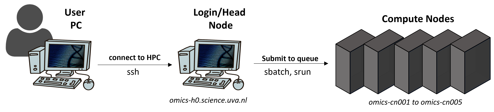

## HPC introduction

On day 2, we work on **Crunchomics**, the Genomics Compute Environment for SILS and IBED. Crunchomics is an **HPC** (high-performance computer): a group of powerful computers that many people share. If you work at IBED, you can get access to it by sending an email with your UvAnetID to Wim de Leeuw ([w.c.deleeuw\@uva.nl](mailto:w.c.deleeuw@uva.nl){.email}), as described on the [Before you start](installation.qmd) page.

Working on an HPC is a bit different from working on your own computer. The figure below gives a simplified overview:

{width="70%" fig-align="center"}

-   When you log in, you arrive on the **login node**, also called the **head node**. This computer is for preparing your work, for example moving and editing files and writing job scripts. It is not for running analyses.
-   The analyses run on the **compute nodes**. These computers have many more CPUs and much more memory.
-   In between is **SLURM**, a **workload manager** (also called a **scheduler**) that is used on many large HPCs. You send your analysis to SLURM as a **job**, and SLURM runs it on a compute node.  SLURM does three things:
    -   It gives users access to CPUs and memory on the compute nodes, for a limited time
    -   It starts and runs the jobs, and lets you check on them
    -   It manages the **queue**: the list of jobs that wait until enough CPUs and memory are free

::: callout-important
**Crunchomics etiquette**

You share Crunchomics with many other people, so only ask for the resources that you actually use. There are no hard limits, but please follow these rules:

-   Do NOT run jobs that need many CPUs or a lot of memory on the login node (`omics-h0`). Use the compute nodes (`omics-cn001` to `omics-cn005`) for this
-   Do NOT use more than 20% of the CPUs or memory of the cluster for more than a day. If you have large jobs, contact Wim de Leeuw
-   Don't leave resources that you reserved unused, and set reasonable time limits on your jobs
-   Use the queue (SLURM) for large jobs. Working interactively is possible, but not for large jobs. We learn how to use the queue on day 2
-   Close programs when you don't use them anymore, for example an R session
:::

## Storage

On Crunchomics, you have two folders (`$USER` stands for your user name):

-   Your **home directory**, `/home/$USER`, with 25 GB of space
-   Your **personal directory**, `/zfs/omics/personal/$USER`, with 500 GB of space. On day 2, we make a shortcut to it, `~/personal`, and keep our project folder there

Good to know:

-   Your data is removed from Crunchomics when your UvAnetID expires
-   If you need more space, or a shared folder for a larger project with several team members, contact the Crunchomics team
-   **Snapshots:** every day at midnight (00:00), Crunchomics makes a **snapshot**, a saved copy of your files, and keeps it for 2 weeks. So if you delete a file by mistake, it can be restored for up to 2 weeks. But this also means that files you delete still count towards your storage limit for 2 weeks
-   Your data is stored on several disks, which protects it if one disk breaks. But it is not copied anywhere else. **Crunchomics is not a backup or an archive.** You are responsible for backing up your own data. The [website of the IBED computational support team](https://ibed.uva.nl/facilities/computational-facilities/ibed-computational-support-team/ibed-computational-support-team.html) explains the archiving options at the UvA

## Compute resources

-   Crunchomics has 5 compute nodes, each with 64 CPUs and 512 GB of memory
-   If you need more resources, or GPUs, see the [website of the IBED computational support team](https://ibed.uva.nl/facilities/computational-facilities/ibed-computational-support-team/ibed-computational-support-team.html)
-   You find more information in the [Crunchomics documentation](https://crunchomics-documentation.readthedocs.io/en/latest)

On the next page, we copy the sequencing data from day 1 to Crunchomics and get read statistics with seqkit. Then we clean the reads with fastp, which we install ourselves with conda. On the way, we learn different ways to send jobs to the compute nodes with SLURM.

