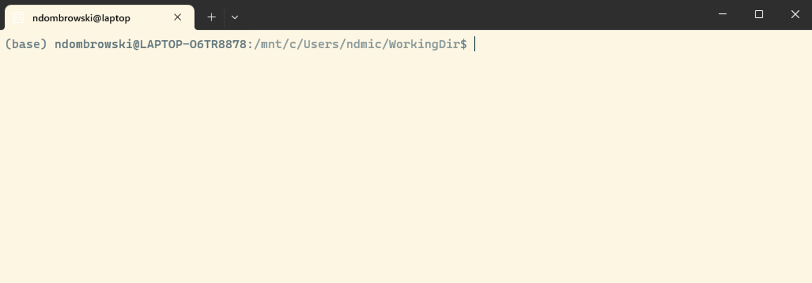
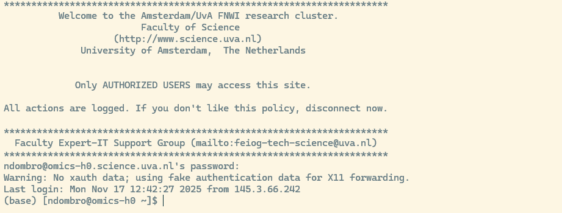

<div style="text-align: justify">

# Before you start

On this page you set up everything you need for this tutorial. It takes about 30 to 60 minutes.

- **If you join the in-person workshop:** please do this at home before day 1. Then we can use the time in class for the commands themselves.
- **If you follow the tutorial on your own:** do this before you start with the first chapter.

Here is what you will do:

1. Request access to Crunchomics, the UvA computer cluster we use in the second part of the tutorial (day 2 of the workshop).
2. Learn a few terms: terminal, shell and prompt.
3. Install or open a terminal on your laptop (MobaXterm: also choose a permanent folder).
4. Check 1: test that your terminal works.
5. Check 2: log in to Crunchomics and log out again.
6. Choose a text editor for your notes.

::: callout-important
## Getting help

If something on this page does not work, please email Nina Dombrowski (n.dombrowski@uva.nl). Part of my job is to support students and researchers with bioinformatics, so you can also contact me if you follow this tutorial on your own, or if you run into problems later.

If you join the workshop, please contact me **at the latest one week before the workshop**. That way we can solve the problem before day 1.

In your email, tell me which operating system you use (Windows, Mac or Linux), which step went wrong, and copy the exact error message (or add a screenshot).
:::

## Step 1: Request access to Crunchomics

In the second part of this tutorial (day 2 of the workshop), we work on **Crunchomics**, a high-performance computer (**HPC**) at the UvA. An HPC is a group of powerful computers that many people share. You use it for analyses that are too large or too slow for your laptop.

You need an account to use Crunchomics. Getting one usually takes 1 to 3 days, so do this step first.

To request access, send an email to Wim de Leeuw (W.C.deLeeuw@uva.nl):

- Ask for access to the Crunchomics HPC.
- Include your **UvAnetID** (the ID you use to log in to UvA systems).
- Put your PI or supervisor in cc. Each account needs to be linked to a permanent staff member.

You get an email back once your account is ready. You need the account for Check 2 below.

## Step 2: Some terms

In this tutorial we use the **command-line interface (CLI)**. It is an alternative to the **graphical user interface (GUI)** that you probably know better. Both let you work with your computer, but in different ways:

- In a GUI, you click on buttons, open folders and use menus.
- In the CLI, you type text to give **commands** (instructions to the computer), and you see the result as text.

When people talk about the CLI, you will also hear the words terminal, shell and prompt. They are related, but they are not the same:

- The **terminal** is the window or program in which you type commands. Some people call it the **console**.
- The **shell** is the program that reads the commands you type in the terminal and tells the operating system what to do. There are several shells, for example **bash** and **zsh**. They use slightly different rules, but the basic commands are the same. This tutorial uses bash.
- The **prompt** is the text that the shell shows when it is ready for your next command. It often shows your user name, the name of your computer and the folder you are in. It usually ends with a `$` sign. For example: `user@laptop:~$`

## Step 3: Install or open a terminal

### Windows

Windows does not come with a terminal that understands bash commands, so you need to install one. I recommend option 1.

1. **MobaXterm** (recommended)
    - A terminal program with the most common Linux commands built in. It can also connect to an HPC.
    - Small and easy to install. This is the best option if you are new to the command line.
    - Follow these installation instructions: [MobaXterm setup](https://hpc.ncsu.edu/Documents/mobaxterm.php). The free Home Edition is all you need.
    - The Home Edition comes in two versions: the **installer edition** and the **portable edition**. Both work for this tutorial. The portable edition does not need administrator rights, so choose it if you cannot install software on your computer (for example on a UvA computer). You unzip it and start MobaXterm from that folder.
    - After you install it, open MobaXterm and click on **Start local terminal**.
    - Then change two settings, see "MobaXterm: choose a permanent folder" below.
2. **Windows Subsystem for Linux (WSL2)**
    - Installs a full Linux system inside Windows. We recommend Ubuntu, which is the default and uses bash.
    - This is a heavier installation. It needs more disk space and more computer resources than MobaXterm.
    - Choose this option if you are comfortable with installing software, or if you already use the command line.
    - Follow the installation instructions from Microsoft: [Install WSL](https://learn.microsoft.com/en-us/windows/wsl/install).
    - After you install it, open the **Ubuntu** app from the Start menu.

#### Windows + MobaXterm: choose a permanent folder

If you installed MobaXterm, please read the text below!

MobaXterm keeps two things in folders that you can choose:

- Your **home directory**: your personal folder in the terminal, which MobaXterm calls `/home/mobaxterm`. This is where you work during the tutorial.
- The **root directory** `/`: the system part of the terminal. Extra programs that you install into MobaXterm (for example the text editor `nano`) are stored here.

Depending on the edition, MobaXterm keeps both in a temporary folder and **deletes them when you close MobaXterm** (the portable edition does this by default). Then all your work from day 1 would be gone on day 2, and you would have to install extra programs again every time.

To prevent this, tell MobaXterm to use a normal folder on your computer. This has an extra advantage: you can find all your files from the tutorial in File Explorer.

1. **Make a new folder.** Open File Explorer and go to **This PC**, then the **C: drive** (it may be called "OS (C:)" or "Local Disk (C:)"), then **Users**, then the folder with your user name. Make a new folder there and call it `MobaXterm_home`. The full path is then `C:\Users\YourUserName\MobaXterm_home`.
2. **Tell MobaXterm to use it.** In MobaXterm, click on **Settings** in the top toolbar, then **Configuration**, and go to the **General** tab. Choose your new folder in two places:
    - Next to **Terminal home directory**, click on the yellow folder icon and choose `MobaXterm_home`.
    - Next to **Terminal root (/) directory**, click on the yellow folder icon and choose `MobaXterm_home` as well.
    - MobaXterm then shows the folders as `_ProfileDir_\MobaXterm_home` and `_ProfileDir_\MobaXterm_home\slash`. That is fine: `_ProfileDir_` is MobaXterm's short name for `C:\Users\YourUserName`. (In older MobaXterm versions, these fields are called **Persistent home directory** and **Persistent root (/) directory**.)
3. Click **OK**. Close MobaXterm and open it again.

Why not the Desktop or the Documents folder? On many computers, these folders are synced with **OneDrive**. OneDrive tries to upload every file you make there, and sequencing data can get large. A folder directly in your user folder is not synced.

### Mac

Every Mac comes with a terminal. You do not need to install anything. To open it, do one of these:

- In Finder, go to **Go**, then **Utilities**, and open **Terminal**.
- Or press Cmd + Space to open Spotlight, type `Terminal` and press Return.

Newer Macs (macOS Catalina and later) use zsh as their shell, not bash. That is fine. Almost everything in this tutorial works the same way in zsh, and I point out the places where it is different.

### Linux

Every Linux system comes with a terminal, and the shell is usually bash. You do not need to install anything. Open the terminal from your applications menu, or search for "Terminal" (depending on your system it can also be called Konsole or xterm).

## Step 4: Check 1, test your terminal

When the terminal is open, you should see a window with a prompt, similar to the one below. Your prompt will show your own user name and computer name, and the colors may be different.

<p align="left">



</p>

Type the command below in your terminal and press Enter. Type it exactly as it is shown. Capital letters matter.

```{bash}
# Print the name of the shell you are using
echo $SHELL
```

`echo` prints text to the screen. `$SHELL` stands for the name of the shell you use, so together they print that name.

On my computer (WSL with Ubuntu), this prints:

```
/bin/bash
```

Your output may look a bit different. What matters is that you see a line that ends with `bash` or `zsh` (for example `/bin/zsh` on a newer Mac). If you see this, your terminal works.

## Step 5: Check 2, log in to Crunchomics

Do this check once you have the email that your Crunchomics account is ready.

### Your network

You can only connect to Crunchomics from the UvA network:

- At the UvA, use the **eduroam** Wi-Fi. The open Amsterdam Science Park Wi-Fi does not work.
- From home or anywhere else, connect to the **UvA VPN** first. If you have not set up the VPN, or it does not work, contact the UvA ICT service desk.

### Log in

To log in to Crunchomics, type the command below. Replace `uvanetid` with your own UvAnetID, and press Enter.

```{bash}
# Log in to Crunchomics (replace uvanetid with your own UvAnetID)
ssh uvanetid@omics-h0.science.uva.nl
```

What the parts mean:

- `ssh` (secure shell) is the command that connects your terminal to another computer.
- `uvanetid@` tells Crunchomics who you are.
- `omics-h0.science.uva.nl` is the address of the computer you connect to.

Two things that surprise most people the first time:

- The first time you connect, you may get a question that ends with `Are you sure you want to continue connecting (yes/no/[fingerprint])?`. Type `yes` and press Enter. Your computer then remembers Crunchomics and does not ask again.
- Then you are asked for your password. Use your UvA password. **While you type the password, nothing appears on the screen.** No dots, no stars. That is normal. Type the password and press Enter.

If the login works, you see a welcome message similar to the one below, and the prompt changes. It now shows your UvAnetID and `omics-h0`, the name of the Crunchomics computer. Some lines can look a bit different for you.

<p align="left">



</p>

Every command you type now runs on Crunchomics, not on your laptop. For now, log out again:

```{bash}
# Log out of Crunchomics and return to your own laptop
exit
```

The prompt changes back to the one of your laptop. Check 2 is done.

### If the login does not work

Check these points first:

- Did you get the email that your account is ready?
- Did you type your UvAnetID correctly, and is there an `@` between your UvAnetID and the address?
- Did you use the correct UvA password? Remember that nothing appears while you type it.
- Are you on eduroam (at the UvA) or connected to the VPN (outside the UvA)?

The error message also gives a hint. `Permission denied` usually means a wrong user name or password, or that the account is not ready yet. If the command takes a long time and then shows `Connection timed out`, it usually means you are not on the UvA network.

If it still does not work, email me (see the box at the top of this page) and copy the error message.

## Step 6: Choose a text editor for your notes

While you work through the tutorial, you keep a notes file. Each time you run a command, you copy it into the file, with a short comment that says what it does. This is the start of documenting your code: it lets you, and others, repeat and understand your analysis later.

For this you need a **plain text editor**, a program that saves only the text you type, without any layout. Do not use Word or a similar program. These programs change some characters, for example a straight quote `'` into a curly quote `’`. A command with a curly quote does not work anymore.

Pick one of these options:

- **RStudio**: if you already use R, this is the easiest choice. Go to **File**, then **New File**, then **Text File**.
- **Notepad** (Windows, already installed) or [Notepad++](https://notepad-plus-plus.org/) (Windows, free, shows code in color).
- **TextEdit** (Mac, already installed): first go to **Format**, then **Make Plain Text**, otherwise TextEdit saves the file with layout.
- **Text Editor** or gedit (Linux, usually already installed).
- [**VS Code**](https://code.visualstudio.com/): a powerful code editor for all systems. It takes a bit more time to set up, so I only recommend it if you already use it.

To check that it works, open your editor, create a new file, type a line of text and save it as `cli_workshop_notes.txt`. You use this file from the first chapter on.

## You are ready

If both checks worked and you have a notes file, you are ready to start. If you join the workshop: see you on day 1!

</div>
